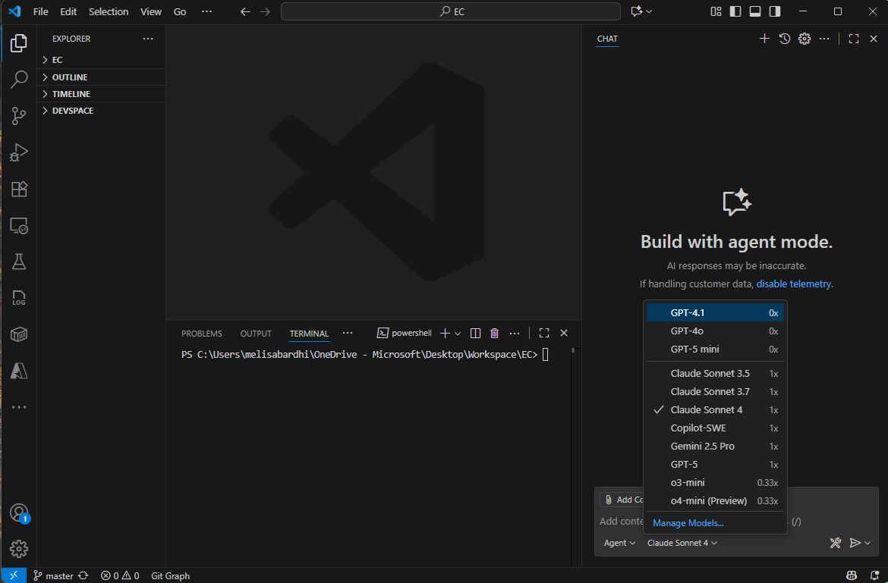
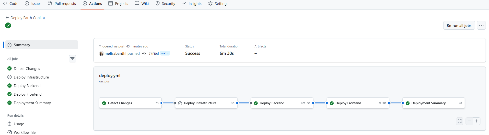
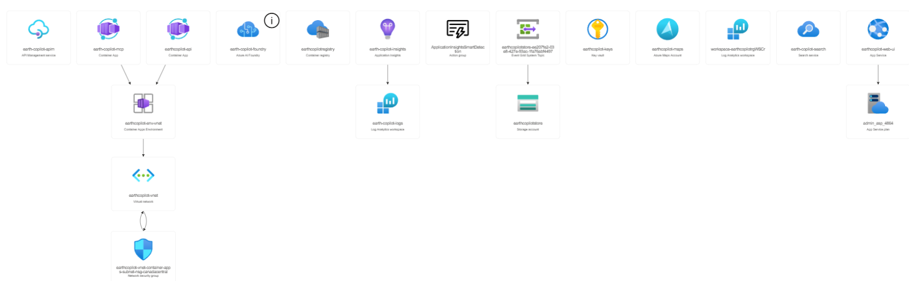
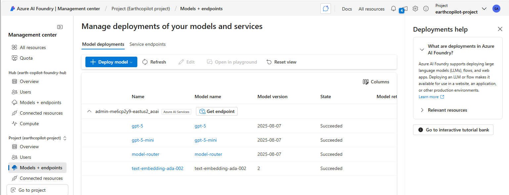
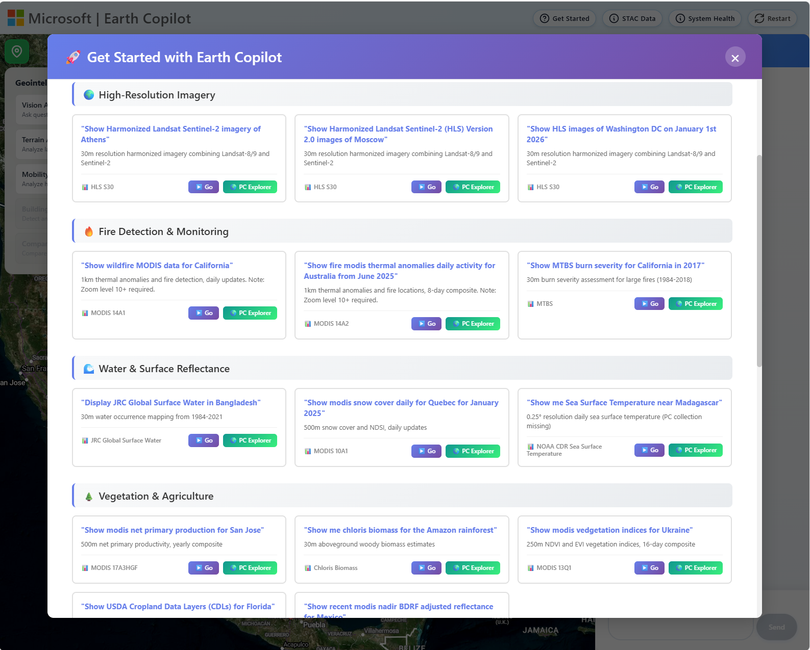

# Quick Deploy - Earth Copilot (GitHub Actions)

**Full automated deployment to Azure via GitHub Actions**

Deploy Earth Copilot to your Azure subscription with full automation. This workflow deploys all infrastructure, backend, and frontend in < 1 hour.

### What Gets Deployed

Earth Copilot is a multi-agent geospatial AI system powered by **Azure AI Agent Service** and **Semantic Kernel**.

The infrastructure includes Azure AI Foundry (with GPT model deployment of your choice + Agent Service Hub/Project), Container Apps, Azure Maps, Container Registry, Key Vault, and Storage. Optionally add VNet + private endpoints for production lockdown.


## Deployment Overview

These instructions work for any Azure subscription:

| Aspect | Value | Who Provides It |
|--------|-------|-----------------|
| Source repo to fork | `microsoft/Earth-Copilot` | OSS |
| Azure subscription | User's own | User |
| Service principal | Created by user | User |
| GitHub secret | `AZURE_CREDENTIALS` | User |
| Resource group | `rg-earthcopilot` (default) | Workflow (`vars.RESOURCE_GROUP`) |
| Location | `eastus2` (default) | Workflow (`vars.LOCATION`) |
| Project name prefix | `earthcopilot` (default) | Workflow (`vars.PROJECT_NAME`) |
| Resource names | Auto-generated unique | Workflow (dynamic) |
| Private endpoints | **OFF** by default | Workflow (opt-in: `enable_private_endpoints`) |
| Authentication | **ON** if `AUTH_CLIENT_ID` secret is set | User creates app registration + sets secret |

---

## What You'll Need

- **Azure Account**: Active Azure subscription
- **GitHub Account**: To fork this repository
- **Azure CLI**: Required for Azure authentication and resource provider registration ([Install in Step 3](#step-3-install-required-cli-tools))
- **GitHub CLI**: Optional but recommended for easier secret configuration ([Install in Step 3](#step-3-install-required-cli-tools))

### Required Azure Permissions

You need these permissions (all configured manually before deploying):

| Permission Type | Required Role | Purpose | Required? |
|-----------------|---------------|---------|-----------|
| **Azure AD** | "Users can register applications" = Yes (default) OR **Application Developer** role | Create service principal (Step 7) | **Yes** |
| **Azure Subscription** | **Contributor** + **User Access Administrator** | Deploy resources + assign roles | **Yes** |

---

## Step 1: Fork the Repository

1. Go to: https://github.com/microsoft/Earth-Copilot
2. Click the **"Fork"** button at the top right
3. Choose your GitHub account as the destination
4. Wait for the fork to complete (~10 seconds)


**You now have your own copy of Earth Copilot!**

---

## Step 2: Clone and Open in VS Code

```powershell
# Clone your fork
git clone https://github.com/YOUR-USERNAME/Earth-Copilot.git
cd Earth-Copilot

# Open in VS Code
code .
```

Replace `YOUR-USERNAME` with your GitHub username.

---

## Step 3: Install Required CLI Tools

### Azure CLI

**Windows**:
```powershell
winget install Microsoft.AzureCLI
```

**macOS**:
```bash
brew install azure-cli
```

**Linux**:
```bash
curl -sL https://aka.ms/InstallAzureCLIDeb | sudo bash
```

Restart your terminal and verify:
```powershell
az --version
```

### GitHub CLI (Optional but Recommended)

The GitHub CLI makes it easier to configure secrets, trigger deployments, and monitor workflows.

**Windows**:
```powershell
winget install GitHub.cli
```

**macOS**:
```bash
brew install gh
```

**Linux**:
```bash
# Debian/Ubuntu
curl -fsSL https://cli.github.com/packages/githubcli-archive-keyring.gpg | sudo dd of=/usr/share/keyrings/githubcli-archive-keyring.gpg
echo "deb [arch=$(dpkg --print-architecture) signed-by=/usr/share/keyrings/githubcli-archive-keyring.gpg] https://cli.github.com/packages stable main" | sudo tee /etc/apt/sources.list.d/github-cli.list > /dev/null
sudo apt update && sudo apt install gh
```

Restart your terminal and authenticate:
```powershell
gh --version
gh auth login
```

Follow the prompts to authenticate with your GitHub account.

---

## Step 4: Authenticate to Azure

```powershell
# Authenticate with Azure CLI (opens browser)
az login

# Verify you're using the correct subscription
az account show --query "{Name:name, SubscriptionId:id, TenantId:tenantId}" -o table

# If you have multiple subscriptions, set the correct one:
az account set --subscription "YOUR-SUBSCRIPTION-ID"

# If you have multiple tenants and need a specific one:
az login --tenant YOUR-TENANT-ID
```

---

## Step 5: Open GitHub Copilot in Agent Mode (Recommended)

For an AI-assisted deployment experience, use **GitHub Copilot Agent Mode** in VS Code:

1. Press `Ctrl+Shift+I` (Windows/Linux) or `Cmd+Shift+I` (macOS) to open Copilot Chat
2. Click the **Agent Mode** toggle (or type `@workspace` to start)
3. Ask Copilot to help with deployment:
   ```
   Help me deploy Earth Copilot to Azure following QUICK_DEPLOY.md
   ```



---

## Step 6: Register Azure Resource Providers (One-Time Setup)

**Required for Container Apps, AI services, and Agent Service.**

```bash
# Register required resource providers
az provider register --namespace Microsoft.App
az provider register --namespace Microsoft.ContainerService
az provider register --namespace Microsoft.CognitiveServices
az provider register --namespace Microsoft.Maps
az provider register --namespace Microsoft.MachineLearningServices   # Required for AI Foundry Hub/Project (Agent Service)

# Verify registration (should show "Registered")
az provider show --namespace Microsoft.App --query "registrationState"
az provider show --namespace Microsoft.MachineLearningServices --query "registrationState"
```

**This takes 2-3 minutes.** Wait for all to show "Registered" before proceeding.

---

## Step 7: Create Service Principal (One-Time Setup)

**This gives GitHub Actions permission to deploy to your Azure subscription.**

### Create the Service Principal

```powershell
# Get your subscription ID
$subscriptionId = az account show --query id -o tsv

# Create service principal with Contributor role
az ad sp create-for-rbac `
  --name "sp-earthcopilot-dev" `
  --role Contributor `
  --scopes /subscriptions/$subscriptionId `
  --json-auth

# IMPORTANT: Copy the JSON output above - you'll need it for GitHub secrets!

# Also grant User Access Administrator role (required for role assignments)
$appId = az ad sp list --display-name "sp-earthcopilot-dev" --query "[0].appId" -o tsv
az role assignment create `
  --assignee $appId `
  --role "User Access Administrator" `
  --scope /subscriptions/$subscriptionId
```

**Important**: Copy the entire JSON output from the first command (from `{` to `}`). You'll need this in Step 8.

**Keep this secret safe!** Don't commit it to Git or share it publicly.

**Why two roles?**
- **Contributor**: Deploys Azure resources (Container Apps, Key Vault, etc.)
- **User Access Administrator**: Creates role assignments (ACR pull permissions, Key Vault access)

---

## Step 8: Configure GitHub Environment

### Option A: GitHub CLI (Recommended - Fastest)

Use the GitHub CLI to configure the environment and secret:

```powershell
# Navigate to your cloned repo
cd Earth-Copilot

# Create the dev environment (replace YOUR-USERNAME with your GitHub username)
gh api repos/YOUR-USERNAME/Earth-Copilot/environments/dev -X PUT

# Set the service principal secret
gh secret set AZURE_CREDENTIALS --env dev
# When prompted, paste the entire JSON output from Step 7, then press Ctrl+Z
```

### Option B: GitHub Web UI

**8.1 Create Environment**
1. Go to your forked repo on GitHub
2. Click **Settings** tab → **Environments** (left sidebar)
3. Click **New environment**
4. Name: `dev`
5. Click **Configure environment**

**8.2 Add Service Principal Secret**

Use the JSON output from **Step 7** (the service principal you created).

1. Scroll to **Environment secrets**
2. Click **Add secret**
3. Name: `AZURE_CREDENTIALS`
4. Value: Paste the **entire JSON** from Step 7 (including curly braces)
5. Click **Add secret**

The JSON should look like this:
```json
{
  "clientId": "xxxxxxxx-xxxx-xxxx-xxxx-xxxxxxxxxxxx",
  "clientSecret": "your-secret-here",
  "subscriptionId": "xxxxxxxx-xxxx-xxxx-xxxx-xxxxxxxxxxxx",
  "tenantId": "xxxxxxxx-xxxx-xxxx-xxxx-xxxxxxxxxxxx",
  ...
}
```

> **Note:** The workflow automatically discovers resource names at runtime. To customize defaults, set GitHub Environment variables (`vars.RESOURCE_GROUP`, `vars.LOCATION`, `vars.PROJECT_NAME`) in Settings → Environments → dev. No workflow file edits needed.

### 8.3 Enable Authentication (Recommended)

The pipeline automatically configures Entra ID authentication (EasyAuth) on **both the frontend and backend** — but it needs an **app registration** that you create once manually.

- **Frontend** (App Service): Redirects unauthenticated users to the Microsoft login page
- **Backend** (Container App): Returns `401 Unauthorized` for API requests without a valid token (health and docs endpoints are excluded)
- The frontend automatically forwards the user's identity token on every API call

1. Go to [Azure Portal](https://portal.azure.com) → **Microsoft Entra ID** → **App registrations** → **New registration**
2. **Name**: `EarthCopilot-Auth` (or any name you prefer)
3. **Supported account types**: Single tenant (this organization only)
4. **Redirect URI**: Leave blank (the pipeline sets this automatically)
5. Click **Register**
6. Copy the **Application (client) ID** from the overview page

Then set it as a GitHub secret:

```powershell
# Set the app registration client ID
gh secret set AUTH_CLIENT_ID --env dev
# Paste the Application (client) ID, then press Ctrl+Z (Windows) or Ctrl+D (macOS/Linux)
```

> **Why manual?** Creating app registrations requires Microsoft Graph API permissions (`Application.ReadWrite.All`) — these are directory-level permissions separate from Azure RBAC. A standard deployment service principal (Contributor + User Access Administrator) doesn't have them. 

> **Skip this step** if you want to deploy without authentication first and add it later.

---

## Step 9: Deploy via GitHub Actions

**Now the automated part begins!** The default deployment is **public** with Entra ID authentication (if `AUTH_CLIENT_ID` is set in Step 8.3).

### Option A: GitHub CLI (Recommended)

```powershell
# Trigger deployment — public by default; auth enabled if AUTH_CLIENT_ID is set (Step 8.3)
gh workflow run deploy.yml -f force_all=true

# Watch the workflow run
gh run watch
```

> **Want a fully private deployment?** For production lockdown with VNet, private endpoints, and ACR agent pool:
> ```powershell
> gh workflow run deploy.yml -f force_all=true -f enable_private_endpoints=true
> ```
> This adds VNet integration, private DNS zones, and a VNet-integrated ACR build agent. First deploy takes ~30-45 min.

> GPT-5 requires `GlobalStandard` capacity which not all subscriptions have.
> You can alternatively run with GPT-5 disabled — the app auto-selects GPT-4o as primary instead:
> ```powershell
> gh workflow run deploy.yml -f force_all=true -f deploy_gpt5=false
> ```

> Flags can be combined: `-f enable_private_endpoints=true -f deploy_gpt5=false`

### Option B: GitHub Web UI

1. Go to your forked repository on GitHub
2. Click the **Actions** tab
3. Select **"Deploy Earth Copilot"** workflow
4. Click **"Run workflow"** button
5. Check **"Force deploy all components"** to deploy everything
6. Check **"Enable private endpoints"** for a fully private/VNet deployment (optional)
7. Uncheck **"Deploy GPT-5 model"** if your subscription lacks `GlobalStandard` quota
8. Click **"Run workflow"**

---

## Step 10: Monitor Deployment

**Expected deployment time**: ~15 minutes for the default public deployment. ~30-45 minutes on first deploy with `enable_private_endpoints` (includes ACR agent pool provisioning), ~15 minutes on subsequent deploys.

```powershell
# Watch the workflow run (if using GitHub CLI)
gh run watch

# Or view in browser
gh run list --workflow=deploy.yml
```

The workflow runs these jobs:
1. **Detect Changes** — Determines which components need deployment (or deploys all if `force_all=true`)
2. **Deploy Infrastructure** — All Azure resources including AI Foundry (model of your choice + Agent Service Hub/Project), Container Apps Environment, ACR, Azure Maps, Key Vault, Storage, Log Analytics, VNet + Private Endpoints
3. **Deploy Backend** — Container App with FastAPI + all agents (Router, Vision, Terrain, Mobility, Building Damage, Comparison, Extreme Weather) + automatic credential configuration via managed identity
4. **Deploy Frontend** — App Service with React UI (includes GEOINT module selectors for Terrain, Mobility, Extreme Weather, Building Damage, and Comparison)
5. **Enable Agent Service** — Enables Agent Service capability hosts on AI Foundry so GEOINT agents can use multi-turn tool orchestration (fallback: `scripts\enable-agent-service.ps1`)
6. **Configure Auth** — Configures Entra ID EasyAuth on both frontend (login redirect) and backend Container App (Return401) using the app registration from Step 8.3 (skipped if `AUTH_CLIENT_ID` secret is not set)
7. **Summary** — Prints deployment status, endpoints, auth configuration, and Agent Service status


**Example Resource Group:**



**Example Azure AI Foundry Deployment:**



---

## Step 11: Access Your Application

After deployment completes, you can find your application URLs in multiple ways:

### Option 1: GitHub Workflow Summary 

1. Go to your repository → **Actions** tab
2. Click on the completed **"Deploy Earth Copilot"** workflow run
3. Scroll down to the **"Deployment Summary"** at the bottom
4. The summary lists your **Frontend URL**, **Backend API URL**, and **API Docs URL**

> All resource names are auto-generated with a unique suffix based on your subscription. The exact URLs are known after deployment.

### Option 2: Azure Portal

1. Go to [Azure Portal](https://portal.azure.com)
2. Navigate to your resource group: `rg-earthcopilot`
3. Find the **App Service** (name starts with `app-`)
4. Click on it → the **URL** is shown at the top right

### Option 3: Azure CLI

```powershell
# Get frontend URL
az webapp show --name (az webapp list --resource-group rg-earthcopilot --query "[0].name" -o tsv) --resource-group rg-earthcopilot --query "defaultHostName" -o tsv

# Get backend URL
az containerapp show --name (az containerapp list --resource-group rg-earthcopilot --query "[0].name" -o tsv) --resource-group rg-earthcopilot --query "properties.configuration.ingress.fqdn" -o tsv
```

**Your Earth Copilot is now live!** Open the frontend URL and click **Get Started** to try sample searches. The rest of the steps in this guide are optional.



---

## Step 12 (Optional): Restrict Access to Specific Users

If you completed Step 8.3, authentication is enabled and **all users in your tenant** can sign in. To restrict access to only specific users:

### Option A: Azure Portal (Recommended — No Graph Permissions Needed)

1. Go to [Azure Portal](https://portal.azure.com) → **Microsoft Entra ID** → **Enterprise applications**
2. Search for your app registration name (e.g., `EarthCopilot-Auth`)
3. **Properties** → Set **Assignment required?** to **Yes** → **Save**
4. **Users and groups** → **Add user/group** → Add the users who should have access

**Example — Adding 3 authorized users:**

| Step | Action |
|------|--------|
| 1 | In **Enterprise applications**, click your app (`EarthCopilot-Auth`) |
| 2 | Left menu → **Properties** → toggle **Assignment required?** to **Yes** → click **Save** |
| 3 | Left menu → **Users and groups** → click **+ Add user/group** |
| 4 | Click **Users** → **None Selected** → search for and select each user by email: |
|   | `alice@contoso.com` |
|   | `bob@contoso.com` |
|   | `charlie@contoso.com` |
| 5 | Click **Select** → click **Assign** |

Once **Assignment required** is set to **Yes**, only users you explicitly add in step 4 can sign in. Everyone else in the tenant gets an `AADSTS50105` error. This applies to both the frontend login and backend API calls since they share the same app registration.

### Option B: Set Before Deploying

Set the `AUTH_AUTHORIZED_USERS` variable before running the workflow. The pipeline will attempt to configure user restrictions (requires the service principal to have Microsoft Graph `AppRoleAssignment.ReadWrite.All` permission, which most SPs don't have by default).

```powershell
# Comma-separated list of user principal names (UPNs)
gh variable set AUTH_AUTHORIZED_USERS --env dev --body "user1@yourdomain.com,user2@yourdomain.com"
```

### If You Skipped Step 8.3 (No Auth Yet)

You can enable auth at any time by completing Step 8.3 and re-running the workflow:

```powershell
# Set the secret, then redeploy
gh secret set AUTH_CLIENT_ID --env dev
gh workflow run deploy.yml -f force_all=true
```

---

## Step 13 (Optional): Integrate with Microsoft Copilot Studio

**Why?** Your analysts already live in **Microsoft Teams** and **M365 Copilot**. Instead of switching to a separate web app, Copilot Studio lets them search satellite imagery and analyze terrain directly from their chat window — no context switching. It's the fastest path to adoption for organizations already on Microsoft 365.

Copilot Studio acts as a **distribution channel** — all AI intelligence stays in your deployed backend. No code changes needed.

| What You Get | How It Works |
|---|---|
| Chat with Earth Copilot in Teams | Copilot Studio agent calls your Container App API |
| Search satellite imagery via natural language | `searchSatelliteImagery` action |
| Analyze terrain at coordinates | `analyzeTerrainAtLocation` action |
| Multi-turn terrain conversations | `chatWithTerrainAgent` with session memory |

**Getting started:** Create a Copilot Studio agent with a custom connector pointing to your deployed backend API. See [Microsoft Copilot Studio documentation](https://learn.microsoft.com/microsoft-copilot-studio/) for setup instructions.

> **Requirements:** Copilot Studio license (included in M365 E3/E5 or standalone) + deployed Earth Copilot backend.

---

## Step 14 (Optional): Connect via MCP Server

**Why?** If your developers use **GitHub Copilot**, **Claude**, or other AI coding assistants, the MCP (Model Context Protocol) server lets them query satellite data and analyze terrain **directly from their IDE** — no browser, no API docs, no curl commands. The AI assistant discovers Earth Copilot's capabilities automatically and calls them in context.

| What You Get | How It Works |
|---|---|
| Query satellite imagery from VS Code Copilot Chat | MCP tools with dynamic capability discovery |
| Multi-turn conversations with context memory | MCP preserves session state across turns |
| Works with any MCP-compatible client | GitHub Copilot, Claude Desktop, custom agents |
| Domain-specific expert prompts | Built-in geospatial analyst personas |

**Follow the full guide:** [earth-copilot/mcp-server/README.md](earth-copilot/mcp-server/README.md)

> **Requirements:** Deployed Earth Copilot backend + an MCP-compatible client (GitHub Copilot in VS Code, Claude Desktop, etc.).

