[](https://codespaces.new/microsoft/earth-copilot)

# 🌍 Welcome to Earth Copilot 2.0!
**An AI-powered geospatial application that allows you to explore and visualize vast Earth science data using natural language queries.**

## 🎯 Overview

Built with Azure OpenAI, Semantic Kernel agents, and containerized microservices, Earth Copilot automatically finds the right planetary data collection, renders it on a map, and analyzes it for you. Whether you're a scientist, analyst, or decision-maker, Earth Copilot helps you spend less time finding data and more time unlocking insights.

🎥 **Watch Satya Nadella introduce NASA Earth Copilot 1.0 at Microsoft Ignite 2024**: [View Here](https://www.linkedin.com/posts/microsoft_msignite-activity-7265061510635241472-CAYx/?utm_source=share&utm_medium=member_desktop)


**🚀 Auto-Deploy Ready:** This repository includes fully automated deployment via **Bicep** and **GitHub Actions**. Follow the [Quick Start Guide](QUICK_DEPLOY.md) to deploy the complete architecture: infrastructure, backend, and frontend within one hour. Its modular architecture is designed for extensibility to any use case.

> **This is a proof-of-concept, not a production-ready product.**
> 
> Earth Copilot demonstrates a reusable geospatial AI pattern that can be adapted across different use cases. This open source repository is not supported by Microsoft Copilot and  will continue to evolve.

## ✨ Features

🤖 **Intelligent AI Agents** - Autonomous agents for query classification, data discovery, STAC translation, and geointelligence analysis  
🛰️ **113+ Satellite Collections** - Microsoft Planetary Computer & NASA VEDA data catalog integration  
🗺️ **Advanced Geointelligence Capabilities** - Automatic catalog rendering, terrain analysis, timeseries comparisons, building damage assessment, and mobility analysis among others  
🐳 **Modern Container Architecture** - Azure Container Apps with VNet integration and Entra ID authentication for enterprise security  
🔌 **MCP Server Integration** - Model Context Protocol server for integration with an AI Assistant  
🎨 **Dynamic Multi-Catalog Rendering** - Intelligent tile selection and visualization across diverse satellite data types  

## ✨ What Earth Copilot Does


### Query Examples

**1) Satellite Imagery Visualization Queries**
```
"Show me high resolution satellite imagery of Dubai urban expansion in 2020"
"Show me radar imagery of Houston Texas during Hurricane Harvey August 2017"  
"Show me HLS Landsat imagery for Ukraine Farmland from 2024"
"Show me burned area mapping for Montana wildfire regions 2023"
"Show me elevation profile for Denver, Colorado"
```

**2) Contextual Earth Science Questions**
```
"How was NYC impacted by Hurricane Sandy"
"What was the impact of Hurricane Florence 2018 in North Carolina"  
"How did vegetation recover after flooding in Missouri River valley 2023"
"What are the long-term climate trends affecting Pacific Northwest forests"
"Explain the correlation between El Niño events and wildfire patterns"
```

**3) Geointelligence Modules**
```
"What is the reflectance value at these coordinates?" (Vision)
"Analyze terrain at [lat,lon] for line-of-sight and elevation profile" (Terrain)
"Show wildfire activity in Southern California in January 2025 and analyze how it evolved over 48 hours" (Comparison)
"Classify mobility at [coordinates] across 5 elevation layers" (Mobility)
"Assess building damage at [pin coordinates] using before/after imagery" (Building Damage)
```

**4) Private Data Search with RAG**
```
"Analyze our proprietary STAC collection for mineral exploration sites"
"Compare our private agricultural data with public MODIS vegetation indices"
"Search our internal disaster response catalog for similar flood patterns"  
"Query our custom satellite constellation for urban heat island analysis"
```

### Examples

#### STAC Search Queries

| ALOS World (Berlanga) | Burn Severity (California) | Cropland (Florida) |
|:---:|:---:|:---:|
| 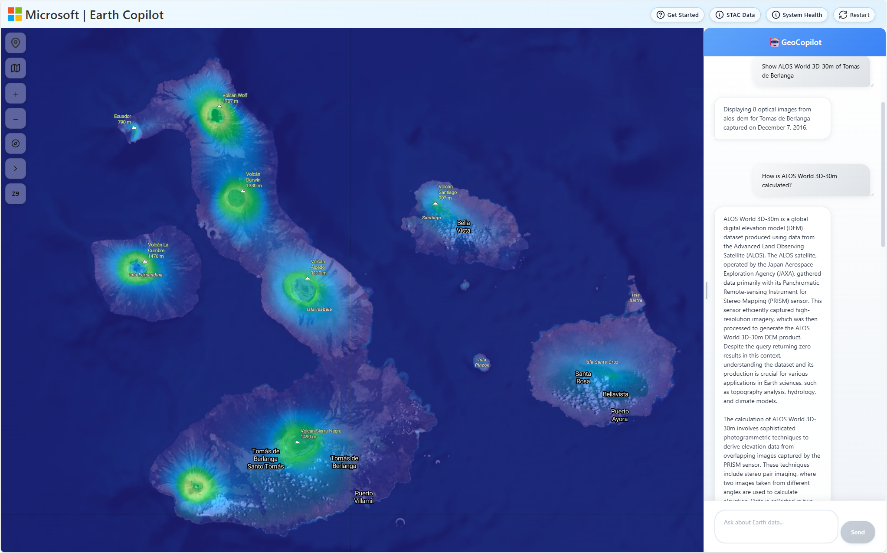 | 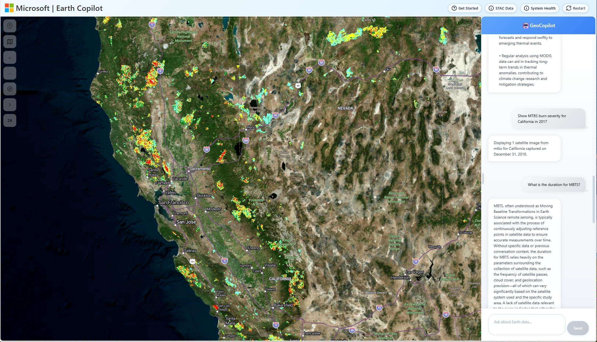 | 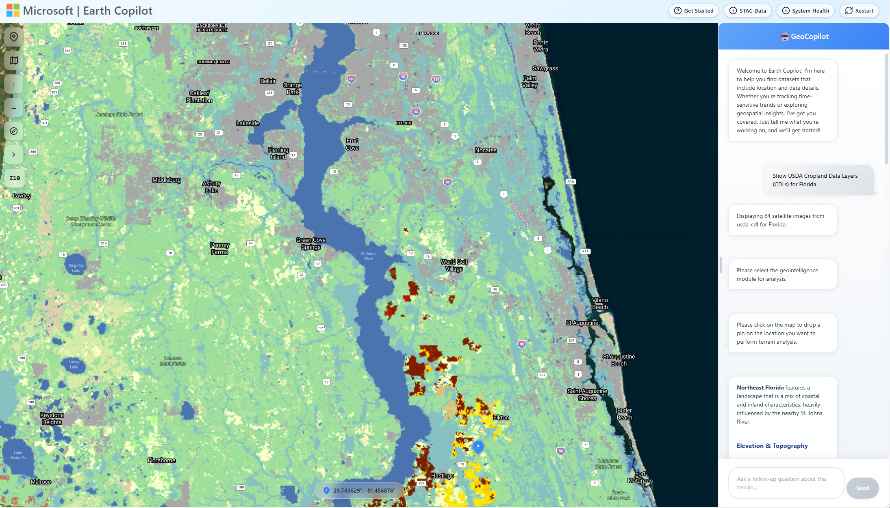 |

| Elevation (Grand Canyon) | HLS Greece Elevation | LIDAR Height (Denver) |
|:---:|:---:|:---:|
| 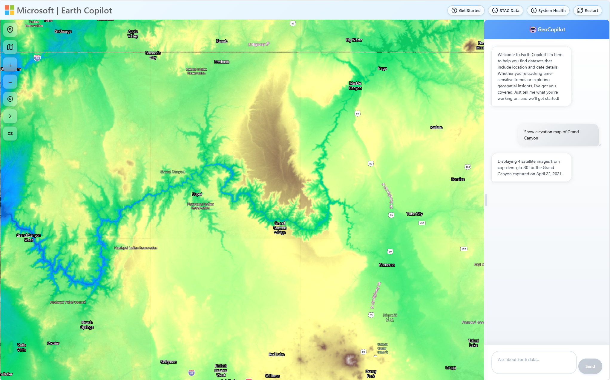 |  |  |

| LIDAR Height (New Orleans) | MODIS Snow Cover (Quebec) | Nadir BDRF (Mexico) |
|:---:|:---:|:---:|
|  | 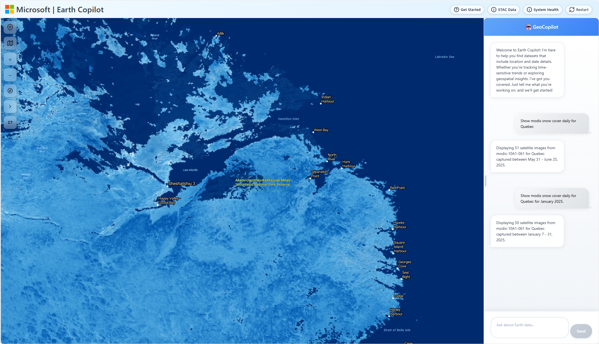 | 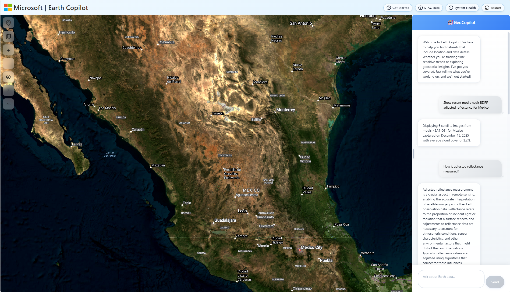 |

| Net Production (San Jose) | Sea Surface Temp (Madagascar) | Sentinel (NYC) |
|:---:|:---:|:---:|
| 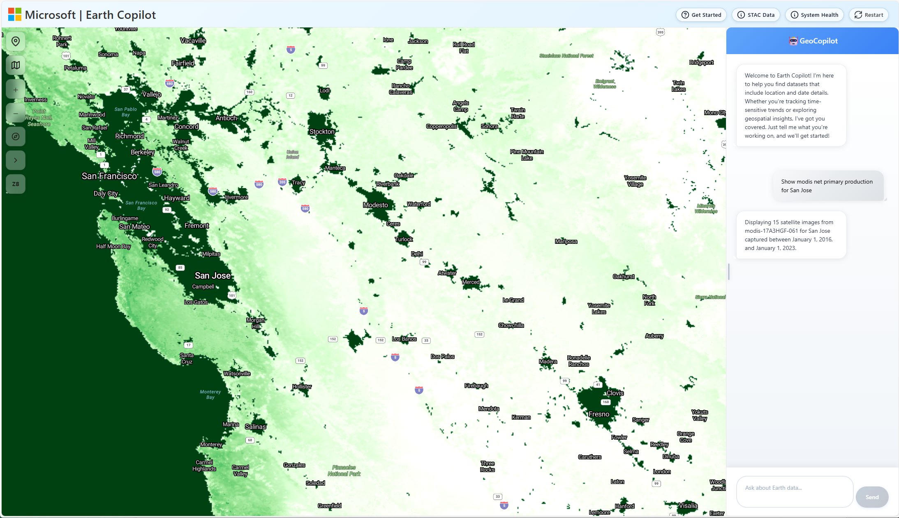 | 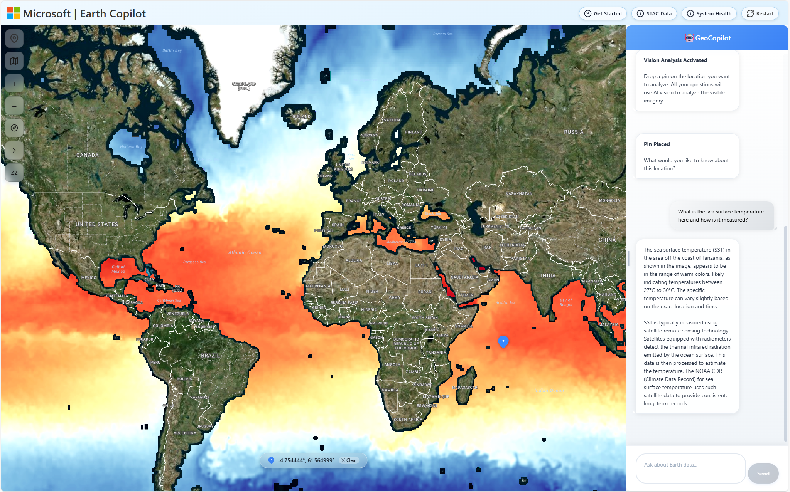 |  |

| Sentinel RTC (Baltimore) | Sentinel RTC (Philippines) | Surface Water (Bangladesh) |
|:---:|:---:|:---:|
|  | 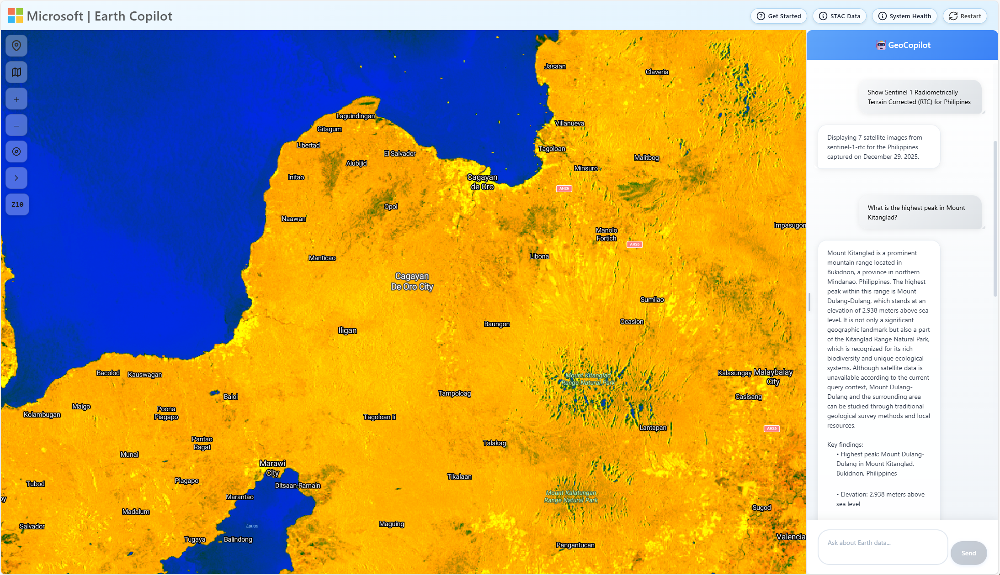 | 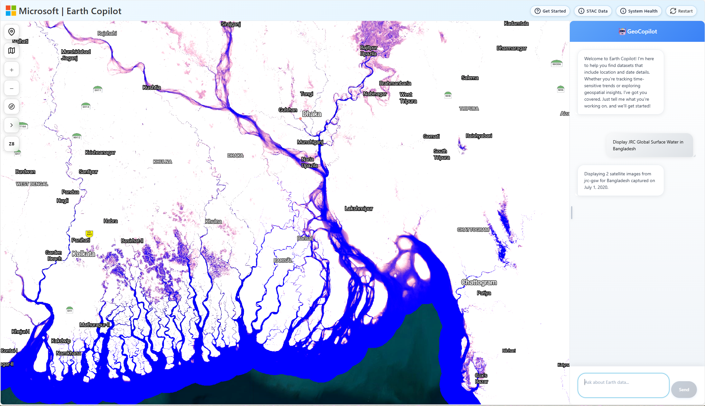 |

| Thermal Anomalies (Australia) | Vegetation Indices (Ukraine) |
|:---:|:---:|
| 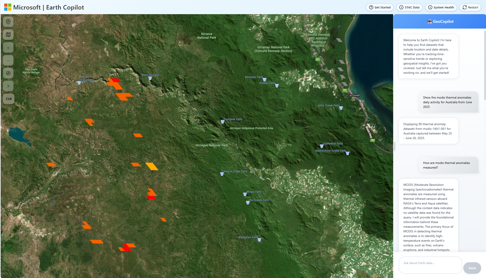 | 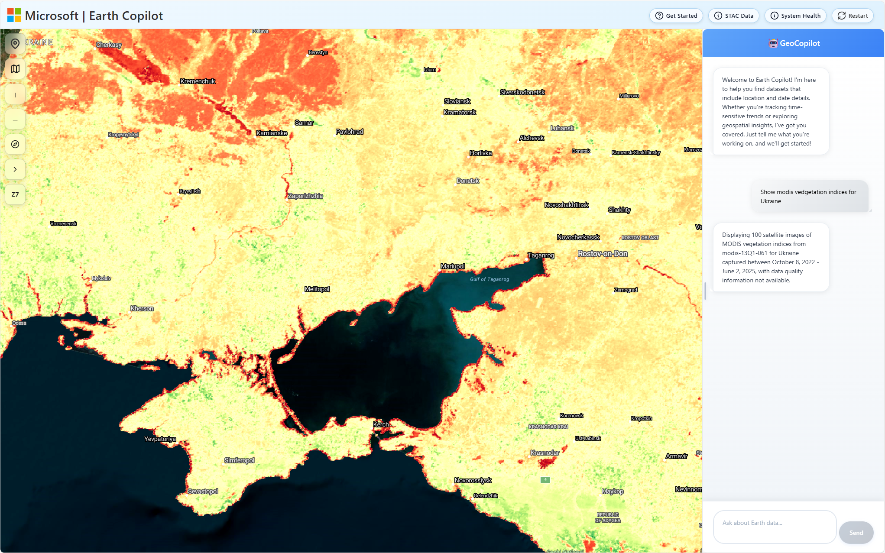 |

---

#### GEOINT Modules

| Mobility Analysis (Ecuador) | Terrain Analysis (Galapagos) |
|:---:|:---:|
|  | 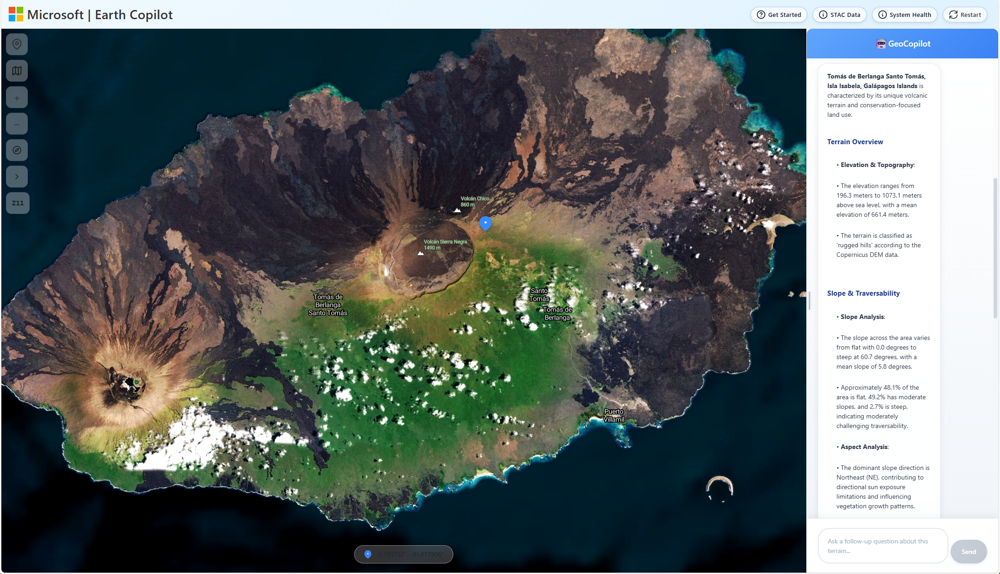 |

| Vision Agent (Athens) | Vision Agent (Moscow) |
|:---:|:---:|
| 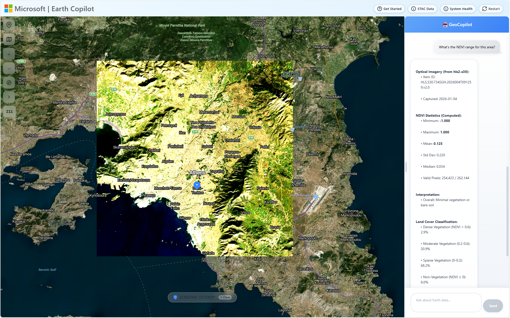 |  |

---


## 🏗️ Architecture


### Query Processing Pipeline

**Core Components:**
| Step | Component | Type | Uses GPT? |
|------|-----------|------|:---------:|
| 1 | **UnifiedRouter** | Classifier | Sometimes |
| 2 | **LocationResolver** | Function Cascade | Sometimes |
| 3 | **Collection Mapping Agent** | LLM Agent | Sometimes |
| 4 | **STAC Query Builder Agent** | LLM Agent | Yes |
| 5 | **STAC Search Executor** | Function | No |
| 6 | **Tile Selector** | Function/Agent | Sometimes |
| 7 | **TiTiler Renderer** | Function | No |

**GEOINT Modules:**
| Module | Agent Class | Type | Status |
|--------|-------------|------|:------:|
| **Vision** | `EnhancedVisionAgent` | SK Agent + 5 Tools | ✅ Active |
| **Terrain** | `TerrainAgent` | SK Agent + Tools | ✅ Active |
| **Mobility** | `GeointMobilityAgent` | Agent + Vision | ✅ Active |
| **Comparison** | `ComparisonAgent` | Agent (Query Mode) | ✅ Active |


**📖 Detailed Architecture Documentation:** [Agent System Overview](documentation/architecture/agent_system_overview.md) 

### Core Services

**⚛️ React UI (`earth-copilot/web-ui/`) - Azure Web Apps**
- **Main Search Interface**: Unified natural language query input
- **Chat Sidebar**: Conversation history with context awareness
- **Azure Maps Integration**: Interactive map with satellite overlay and geointelligence results
- **Data Catalog Selector**: Switch between MPC, NASA VEDA, and custom data sources
- **Technology**: React 18, TypeScript, Vite, Azure Maps SDK v2

**🐳 Container App Backend (`earth-copilot/container-app/`) - Azure Container Apps**
- **Semantic Kernel Framework**: Multi-agent orchestration with GPT-4o/GPT-5
- **AI Agents**: Query processing and geointelligence analysis pipeline
- **STAC Integration**: Microsoft Planetary Computer and NASA VEDA API connectivity
- **Geointelligence Processing**: Terrain analysis, mobility classification, line-of-sight (GDAL/Rasterio)
- **Multi-Strategy Geocoding**: Google Maps, Azure Maps, Mapbox, OpenAI fallback
- **Hybrid Rendering System**: TiTiler integration for 113+ satellite collection types
- **VNet Integration**: Enterprise-grade security with private networking
- **Technology**: Python 3.12, FastAPI, Semantic Kernel, Azure Container Apps

**🤖 MCP Server (`earth-copilot/mcp-server/`) - Model Context Protocol**
- **GitHub Copilot Integration**: Expose Earth Copilot as tool for VS Code
- **HTTP Bridge**: MCP protocol bridge for external tool access
- **3 Core Tools**: `analyze_satellite_imagery`, `terrain_analysis`, `geointelligence_analysis`
- **Technology**: Python, FastAPI, Docker, Azure Container Apps

**🗄️ Azure Infrastructure**
- **Azure AI Foundry**: GPT-4o/GPT-5 deployments for agent intelligence
- **Azure Maps**: Geocoding, reverse geocoding, and map tile services
- **Azure AI Search**: Vector search for private data catalogs (RAG)
- **Azure Storage**: Blob storage for geointelligence raster processing results
- **Azure Key Vault**: Secure API key and secret management
- **Application Insights**: Distributed tracing and performance monitoring
- **Virtual Network**: Private networking with DNS resolution for external APIs

### API Surface

**Core Query Endpoints:**
- `POST /api/query` - Main natural language query processing
- `GET /api/config` - Frontend configuration (API keys, endpoints)
- `GET /api/health` - Service health check

**STAC Search Endpoints:**
- `POST /api/stac-search` - Microsoft Planetary Computer STAC search
- `POST /api/veda-search` - NASA VEDA STAC search
- `POST /api/structured-search` - Structured query search
- `POST /api/sign-mosaic-url` - Sign tile URLs for Planetary Computer

**GEOINT Analysis Endpoints:**
- `POST /api/geoint/vision` - GPT-4o Vision analysis of map imagery
- `POST /api/geoint/terrain` - Elevation, slope, aspect analysis
- `POST /api/geoint/terrain/chat` - Multi-turn terrain analysis conversation
- `GET /api/geoint/terrain/chat/{session_id}/history` - Get terrain chat history
- `DELETE /api/geoint/terrain/chat/{session_id}` - Clear terrain chat session
- `POST /api/geoint/mobility` - 5-layer terrain traversability classification
- `POST /api/process-comparison-query` - Multi-temporal change detection

**Session Management:**
- `POST /api/session-reset` - Reset user session state

**📖 Complete API Documentation:** [documentation/architecture/](documentation/architecture/)


## 🔧 Environment Setup

### Prerequisites

**Technical Background:**
- **Azure Subscription Management** - Resource groups, RBAC, cost management, service quotas
- **Azure Cloud Services** - Azure AI Foundry, Azure Maps, Container Apps, AI Search
- **Python Development** - Python 3.12, FastAPI, async programming, package management
- **React/TypeScript** - React 18, TypeScript, Vite, modern JavaScript
- **AI/ML Concepts** - LLMs, Semantic Kernel, multi-agent systems, RAG
- **Geospatial Data** - STAC standards, satellite imagery, raster processing (GDAL/Rasterio)
- **Docker & Containers** - Docker builds, Azure Container Apps, VNet integration
- **Infrastructure as Code** - Bicep templates, Azure CLI, resource deployment

### Quick Start with VS Code Agent Mode

You can deploy this application using **Agent mode in Visual Studio Code** or **GitHub Codespaces**:

[](https://codespaces.new/microsoft/earth-copilot)


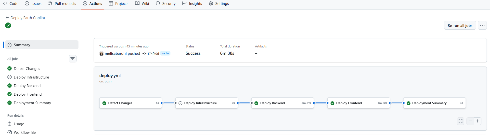

### Azure Services Setup

> 📖 **For step-by-step deployment instructions, see [QUICK_DEPLOY.md](QUICK_DEPLOY.md)**

**Services Deployed Automatically:**
- **Azure AI Foundry** - GPT-4o deployment for AI agents
- **Azure Container Apps** - Backend API hosting
- **Azure Web Apps** - Frontend hosting  
- **Azure Maps** - Geocoding and map visualization
- **Azure Container Registry** - Docker image storage
- **Key Vault** - Secure credential management

**Data Sources (External - No Setup Required):**
- **Microsoft Planetary Computer STAC API** - 113+ global satellite collections (free, public)
- **NASA VEDA STAC API** - Earth science datasets from NASA missions (free, public)

**Example Resource Group:**


**Example Azure AI Foundry Deployment:**


## 🚀 Deployment Guide

### ⚡ GitHub Actions Deployment (Recommended)

Deploy Earth Copilot to Azure using fully automated GitHub Actions.

📖 **Complete Step-by-Step Guide:** [**QUICK_DEPLOY.md**](QUICK_DEPLOY.md) ← Start here!

```powershell
# 1. Fork the repo on GitHub, then clone your fork
git clone https://github.com/YOUR-USERNAME/Earth-Copilot.git
cd Earth-Copilot
```

## 📊 Data Collection Availability

### **Coverage by Category**

**🏔️ Elevation & Terrain - Excellent (95%+)**  
Primary: cop-dem-glo-30, cop-dem-glo-90, nasadem  
Best for: Topography, watersheds, slope analysis, GEOINT terrain assessment

**🔥 Fire Detection - High (90%+)**  
Primary: modis-14A1-061, modis-14A2-061, viirs-fire  
Best for: Wildfire tracking, burn assessment, thermal anomaly detection

**🌱 Vegetation/Agriculture - High (88%+)**  
Primary: modis-13Q1-061, modis-15A2H-061, sentinel-2-l2a  
Best for: Crop health, forest monitoring, NDVI analysis

**🛰️ Optical Satellite - Good (85%+)**  
Primary: sentinel-2-l2a, landsat-c2-l2, hls, naip  
Best for: True color imagery, urban development, land cover mapping

**📡 SAR/Radar - Good (82%+)**  
Primary: sentinel-1-grd, sentinel-1-rtc, alos-palsar  
Best for: Flood mapping, all-weather monitoring, surface deformation

**🌡️ Temperature/Thermal - Good (80%+)**  
Primary: modis-11A1-061, goes-cmi, landsat thermal bands  
Best for: Heat analysis, thermal stress, urban heat islands

**☁️ Climate & Weather - Variable (70%+)**  
Primary: era5-pds, daymet-daily-na, goes-cmi  
Best for: Historical weather, climate analysis, precipitation

**🌊 Marine & Ocean - Variable (65%+)**  
Primary: goes-cmi, modis-sst, sentinel-3  
Best for: Ocean temperature, water quality, coastal monitoring

**📖 Complete Collection Details:** [stac_collections.md](documentation/data_collections/stac_collections.md)


## 📁 Project Structure

```
Earth-Copilot/
├── 📁 earth-copilot/                 # Main application directory
│   ├── 📁 web-ui/                    # React frontend (App Service)
│   │   ├── 📁 src/
│   │   │   ├── 📁 components/         # React components
│   │   │   │   ├── Chat.tsx           # Chat interface with context
│   │   │   │   ├── MapView.tsx        # Azure Maps + satellite overlays
│   │   │   │   ├── DatasetDropdown.tsx # Data source selection
│   │   │   │   └── ...
│   │   │   ├── 📁 services/           # API integration
│   │   │   │   ├── api.ts             # Backend API client
│   │   │   │   └── vedaSearchService.ts # NASA VEDA integration
│   │   │   └── 📁 ui/                 # UI components
│   │   ├── .env.example               # Frontend environment template
│   │   ├── package.json               # Node.js dependencies
│   │   └── vite.config.ts             # Vite build config
│   │
│   ├── 📁 container-app/              # FastAPI backend (Container Apps)
│   │   ├── fastapi_app.py             # Main FastAPI application
│   │   ├── semantic_translator.py     # Agent 3: STAC query orchestrator
│   │   ├── location_resolver.py       # Multi-strategy geocoding
│   │   ├── collection_profiles.py     # Agent 2: Collection mappings
│   │   ├── intent_classifier.py       # Agent 1: Intent classification
│   │   ├── response_generator.py      # Agent 5: Response generation
│   │   ├── tile_selector.py           # Agent 4: Tile selection logic
│   │   ├── geoint_executor.py         # GEOINT orchestration
│   │   ├── terrain_analysis.py        # Agent 6: Terrain analysis
│   │   ├── mobility_classifier.py     # Agent 7: Mobility classification
│   │   ├── line_of_sight.py           # Line-of-sight calculations
│   │   ├── hybrid_rendering.py        # TiTiler rendering configs
│   │   ├── requirements.txt           # Python dependencies (full GEOINT)
│   │   ├── Dockerfile                 # Container build
│   │   └── 📁 archive/                # Legacy Azure Functions code
│   │
│   ├── 📁 mcp-server/                 # Model Context Protocol server
│   │   ├── main.py                    # MCP HTTP bridge
│   │   ├── earth_copilot_tools.py     # MCP tool definitions
│   │   ├── requirements.txt           # MCP dependencies
│   │   ├── Dockerfile                 # MCP container build
│   │   ├── deploy-with-logs.ps1       # Deployment script
│   │   ├── test_deployed_mcp.py       # Production tests
│   │   └── 📁 docs/                   # MCP documentation
│   │
│   ├── 📁 ai-search/                  # Azure AI Search setup
│   │   └── 📁 scripts/                # Index creation scripts
│   │       ├── create_veda_index.py   # NASA VEDA index
│   │       └── requirements.txt
│   │
│   ├── 📁 infra/                      # Infrastructure as Code
│   │   ├── main.bicep                 # Main Bicep template
│   │   └── 📁 app/                    # App-specific resources
│   │
│   └── azure.yaml                     # Azure Developer CLI config
│
├── 📁 documentation/                  # Project documentation
│   ├── 📁 architecture/
│   │   ├── agent_system_overview.md   # Agent architecture
│   │   └── semantic_translator_logic.md
│   ├── 📁 data_collections/
│   │   ├── stac_collections.md        # 113+ collections reference
│   │   ├── maps.md                    # Azure/Google Maps integration
│   │   └── tiles.md                   # Tile rendering guide
│   └── 📁 images/                     # Screenshots and diagrams
│
├── 📁 scripts/                        # Utility scripts
│   └── 📁 stac_availability/          # STAC data exploration
│
├── 📁 .github/                        # GitHub configuration
│   └── 📁 copilot/
│       └── mcp-servers.json           # MCP server config for Copilot
│
├── deploy-infrastructure.ps1          # Deploy all Azure resources
├── requirements.txt                   # Root Python dependencies (dev)
├── README.md                          # This file
├── QUICK_DEPLOY.md                    # Automated deployment guide
├── LICENSE.txt                        # MIT License
├── SECURITY.md                        # Security policy
├── CONTRIBUTING.md                    # Contribution guidelines
└── CODE_OF_CONDUCT.md                 # Code of conduct
```

## 📄 License

MIT License - see [LICENSE.txt](LICENSE.txt) for details.

## Trademarks

This project may contain trademarks or logos for projects, products, or services. Authorized use of Microsoft trademarks or logos is subject to and must follow [Microsoft's Trademark & Brand Guidelines](https://www.microsoft.com/en-us/legal/intellectualproperty/trademarks/usage/general). Use of Microsoft trademarks or logos in modified versions of this project must not cause confusion or imply Microsoft sponsorship. Any use of third-party trademarks or logos are subject to those third-party's policies.

---

## 🤝 Acknowledgments

Earth Copilot was developed by Melisa Bardhi and advised by Juan Carlos Lopez.

A big thank you to our collaborators: 
- **Microsoft Planetary Computer** 
- **NASA**
- **Microsoft Team**: Juan Carlos Lopez, Jocelynn Hartwig, Minh Nguyen & Matt Morrell.

*Built for the Earth science community with ❤️ and AI*
