[](https://codespaces.new/microsoft/earth-copilot)

# 🌍 Welcome to Earth Copilot 2.0!
**An AI-powered geospatial application that allows you to explore and visualize vast Earth science data using natural language queries.**

## 🎯 Tutorial Overview
Use this tutorial to build your own Earth Copilot in Azure and interact with geospatial data without writing code. Earth Copilot will allow you to:

- Interact with geospatial data using natural language queries
- Generate and execute SpatioTemporal Asset Catalog (STAC) API queries
- Explore 126+ Microsoft Planetary Computer (MPC) STAC collections
- Search private, public, or hybrid datasets
- Render diverse STAC collections on Azure maps
- Integrate Earth Copilot into your own research workflows in Azure

### 📖 About Earth Copilot 2.0
Inspired by the NASA and Microsoft Earth Copilot 1.0 prototype, this version features a production-ready architecture built with Semantic Kernel agents, GPT-5 and containerized microservices. Earth Copilot automatically finds the right planetary data collection, renders it on a map and analyzes it for you. Automated bicep deployment scripts streamline setup and a modular architecture enables scalability and customization for any use case. 

Whether you're a scientist, analyst, or decision-maker, Earth Copilot helps you spend less time finding data and more time unlocking insights.

🎥 **Watch Satya Nadella introduce NASA Earth Copilot 1.0 at Microsoft Ignite 2024**: [View Here](https://www.linkedin.com/posts/microsoft_msignite-activity-7265061510635241472-CAYx/?utm_source=share&utm_medium=member_desktop)

## ✨ What Earth Copilot Does

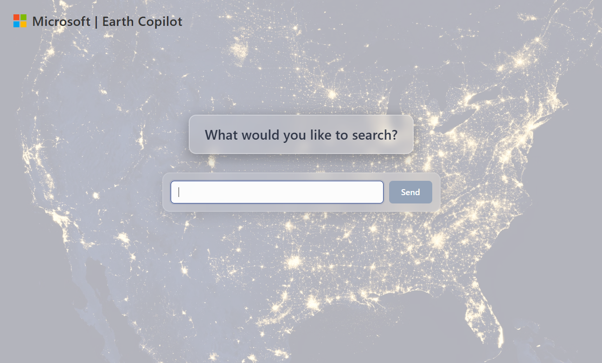

🤖 **13 Intelligent AI Agents** - Autonomous agents for query classification, data discovery, STAC translation, and geointelligence analysis  
🛰️ **126+ Satellite Collections** - Microsoft Planetary Computer & NASA VEDA data catalog integration  
🗺️ **Geointelligence Capabilities** - Automatic catalog rendering, terrain analysis, timeseries comparisons, building damage assessment, and mobility analysis among others  
🐳 **Container Architecture** - Azure Container Apps with VNet integration and Entra ID authentication for enterprise security  
🔌 **MCP Server Integration** - Model Context Protocol server for integration with an AI Assistant  
🎨 **Dynamic Multi-Catalog Rendering** - Intelligent tile selection and visualization across diverse satellite data types  

### 🔍 Query Examples

**1) Satellite Imagery Visualization Queries**
```
"Show me high resolution satellite imagery of Dubai urban expansion in 2020"
"Show me radar imagery of Houston Texas during Hurricane Harvey August 2017"  
"Show me HLS Landsat imagery for Ukraine farmland from 2024"
"Show me burned area mapping for Montana wildfire regions 2023"
"Show me elevation profile for Denver, Colorado"
```

**2) Contextual Earth Science Questions**
```
"How was NYC impacted by Hurricane Sandy"
"What was the impact of Hurricane Florence 2018 in North Carolina"  
"How did vegetation recover after flooding in Missouri River valley 2023"
"What are the long-term climate trends affecting Pacific Northwest forests"
"Explain the correlation between El Niño events and wildfire patterns"
```

**3) Geointelligence Modules**
```
Terrain: "Analyze terrain at [lat,lon] for line-of-sight and elevation profile"
Comparison: "Show wildfire activity in Southern California in January 2025 and analyze how it evolved over 48 hours"
Mobility: "Classify mobility at [coordinates] across 5 elevation layers"  
Building Damage: "Assess building damage at [pin coordinates] using before/after imagery"
Animation: "Display sea level changes along the U.S. Atlantic coast over the past decade"
```

**4) Private Data Search with RAG**
```
"Analyze our proprietary STAC collection for mineral exploration sites"
"Compare our private agricultural data with public MODIS vegetation indices"
"Search our internal disaster response catalog for similar flood patterns"  
"Query our custom satellite constellation for urban heat island analysis"
```

### 📸 Examples
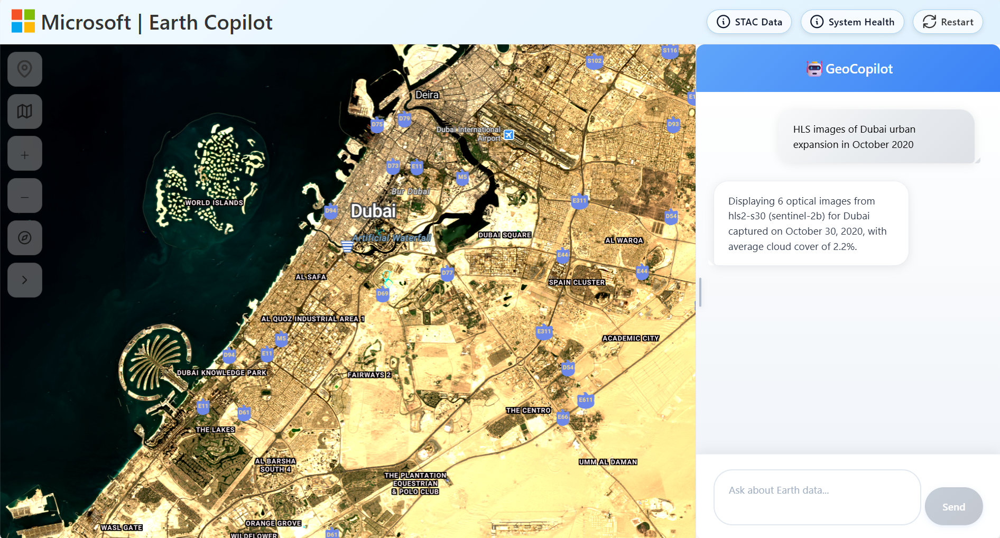
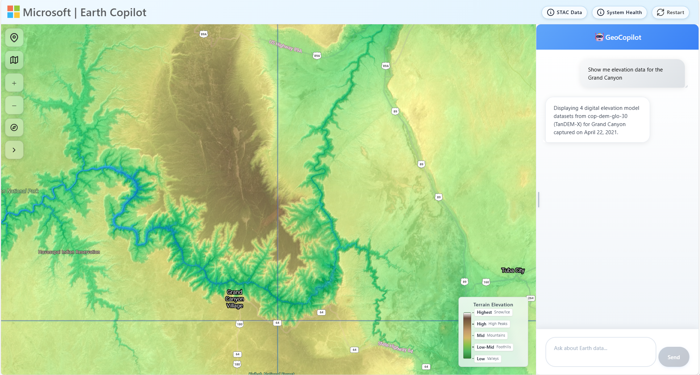

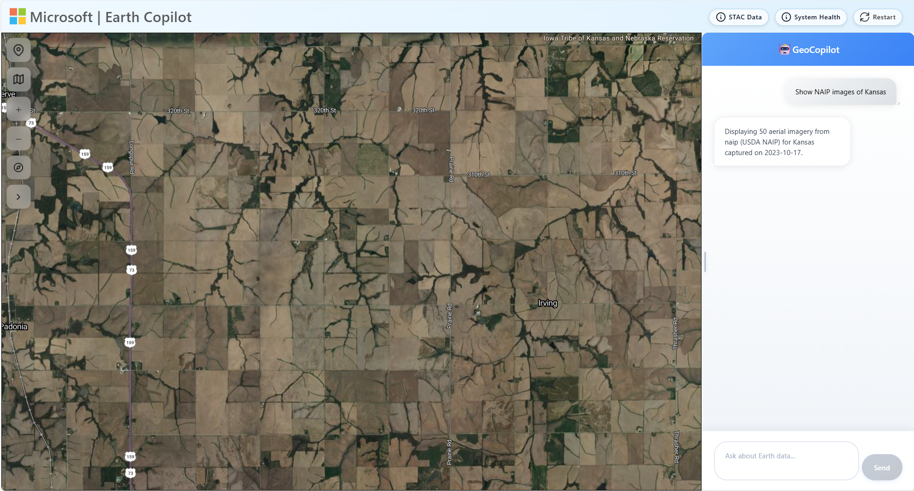
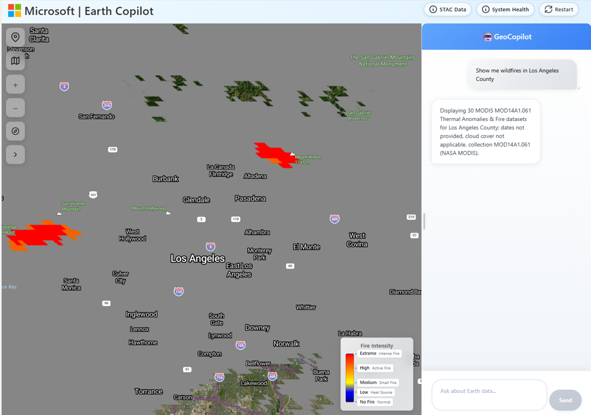
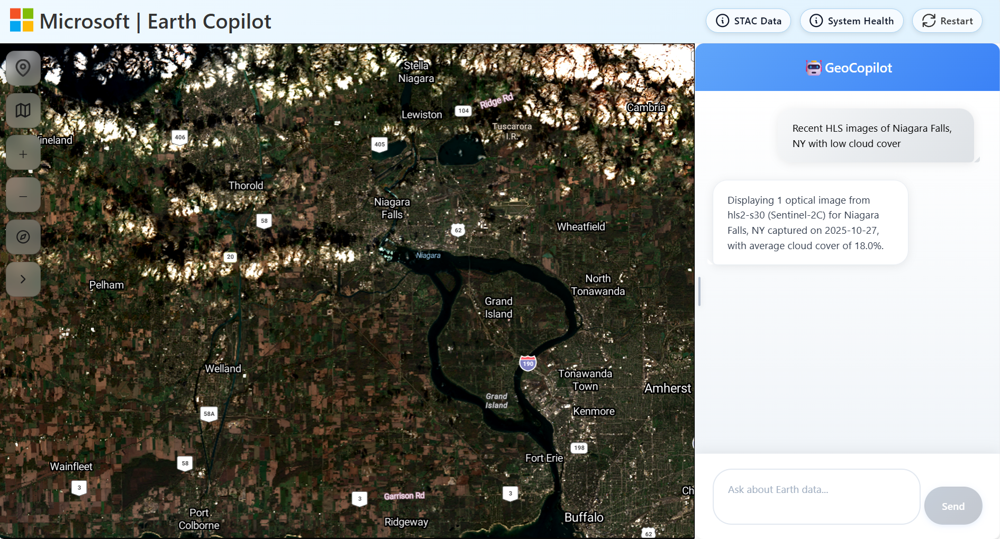
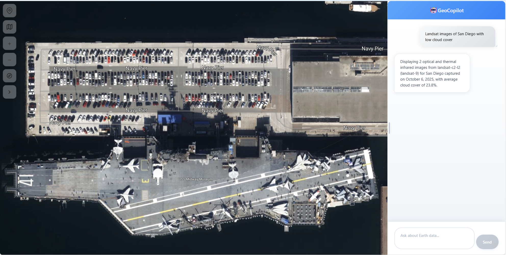
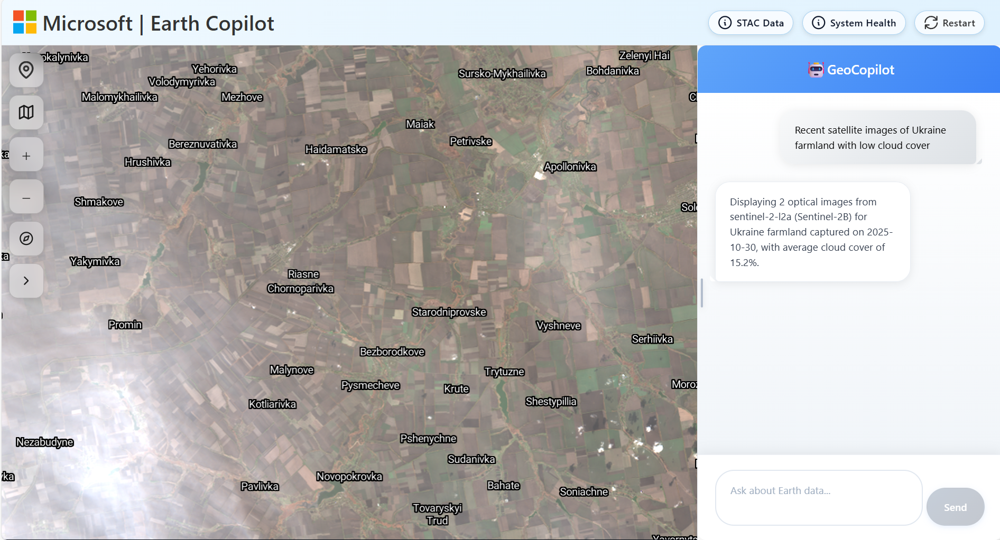
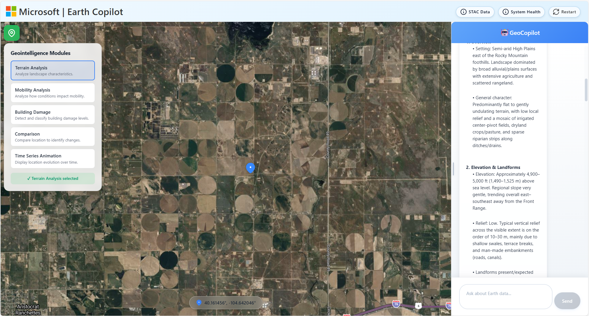


## 🏗️ Architecture

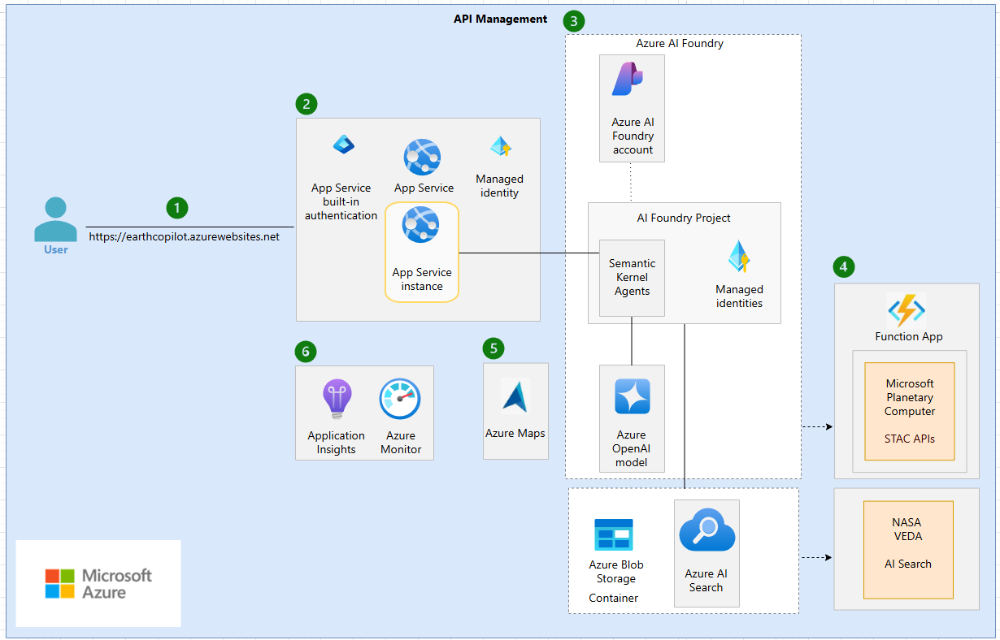

### 🤖 Multi-Agent System (13 Intelligent Agents)

**Core Query Processing Agents (8):**
1. **Agent 1 - Intent Classifier**: Determines query type (satellite, contextual, geointelligence)
2. **Agent 2 - Collection Mapper**: Selects optimal satellite collections from 113+ options
3. **Agent 3 - STAC Query Coordinator**: Coordinates specialized query-building agents
4. **Agent 4 - Location Extractor**: Multi-strategy geocoding and entity extraction
5. **Agent 5 - Datetime Translator**: Natural language to ISO 8601 temporal resolution
6. **Agent 6 - Cloud Filter**: Intelligent quality criteria determination
7. **Agent 7 - Tile Selector**: Intelligent selection for large areas and multiple collections
8. **Agent 8 - Response Generator**: Natural language explanation and context generation

**Geointelligence Agents (5):**

9. **Agent 9 - Terrain Analyzer**: Elevation profiling, slope analysis, viewshed calculations
10. **Agent 10 - Mobility Classifier**: 5-layer raster analysis for terrain traversability
11. **Agent 11 - Building Damage Assessor**: Before/after imagery comparison
12. **Agent 12 - Comparison Analyzer**: Multi-temporal change detection
13. **Agent 13 - Animation Generator**: Time-series visualization

**📖 Detailed Architecture Documentation:** [Agent System Overview](documentation/architecture/agent_system_overview.md)

### ⚙️ Core Services

**⚛️ React UI (`earth-copilot/web-ui/`) - Port 5173**
- **Main Search Interface**: Unified natural language query input
- **Chat Sidebar**: Conversation history with context awareness
- **Azure Maps Integration**: Interactive map with satellite overlay and geointelligence results
- **Data Catalog Selector**: Switch between MPC, NASA VEDA, and custom data sources
- **Technology**: React 18, TypeScript, Vite, Azure Maps SDK v2

**🐳 Container App Backend (`earth-copilot/container-app/`) - FastAPI on Azure Container Apps**
- **Semantic Kernel Framework**: Multi-agent orchestration with GPT-4o/GPT-5
- **13 AI Agents**: Complete query processing and geointelligence analysis pipeline
- **STAC Integration**: Microsoft Planetary Computer and NASA VEDA API connectivity
- **Geointelligence Processing**: Terrain analysis, mobility classification, line-of-sight (GDAL/Rasterio)
- **Multi-Strategy Geocoding**: Google Maps, Azure Maps, Mapbox, OpenAI fallback
- **Hybrid Rendering System**: TiTiler integration for 113+ satellite collection types
- **VNet Integration**: Enterprise-grade security with private networking
- **Technology**: Python 3.12, FastAPI, Semantic Kernel, Azure Container Apps

**🤖 MCP Server (`earth-copilot/mcp-server/`) - Model Context Protocol**
- **GitHub Copilot Integration**: Expose Earth Copilot as tool for VS Code
- **HTTP Bridge**: MCP protocol bridge for external tool access
- **3 Core Tools**: `analyze_satellite_imagery`, `terrain_analysis`, `geointelligence_analysis`
- **Technology**: Python, FastAPI, Docker, Azure Container Apps

**🗄️ Azure Infrastructure**
- **Azure AI Foundry**: GPT-4o/GPT-5 deployments for agent intelligence
- **Azure Maps**: Geocoding, reverse geocoding, and map tile services
- **Azure AI Search**: Vector search for private data catalogs (RAG)
- **Azure Storage**: Blob storage for geointelligence raster processing results
- **Azure Key Vault**: Secure API key and secret management
- **Application Insights**: Distributed tracing and performance monitoring
- **Virtual Network**: Private networking with DNS resolution for external APIs

### 🌐 API Surface (19 Endpoints)

**Core Query Endpoints (4):**
- `POST /api/query` - Main natural language query processing
- `POST /api/chat` - Conversational follow-up questions
- `GET /api/collections` - List available satellite collections
- `GET /api/config` - Frontend configuration (API keys, endpoints)

**Geointelligence Analysis Endpoints (6):**
- `POST /api/geoint/terrain-analysis` - Elevation, slope, viewshed analysis
- `POST /api/geoint/mobility-analysis` - 5-layer terrain traversability
- `POST /api/geoint/elevation-profile` - Terrain cross-section between points
- `POST /api/geoint/line-of-sight` - Visibility calculation with obstacles
- `POST /api/geoint/building-damage` - Before/after damage assessment
- `POST /api/geoint/comparison` - Multi-temporal change detection

**Processing Endpoints (2):**
- `POST /api/stac/search` - Direct STAC API query execution
- `POST /api/render/tiles` - TiTiler URL generation with rendering parameters

**Utility Endpoints (7):**
- `GET /api/health` - Service health check
- `GET /api/docs` - Interactive API documentation (Swagger)
- `GET /api/version` - Version and build information
- `POST /api/geocode` - Location name to coordinates
- `POST /api/reverse-geocode` - Coordinates to location name
- `GET /api/collections/{id}` - Detailed collection metadata
- `GET /api/metrics` - Performance and usage metrics

**📖 Complete API Documentation:** [documentation/architecture/](documentation/architecture/)


## 🔧 Environment Setup

### 📋 Prerequisites

**Technical Background:**
- **Azure Cloud Services** - Azure AI Foundry, Azure Maps, Container Apps, AI Search
- **Python Development** - Python 3.12, FastAPI, async programming, package management
- **React/TypeScript** - React 18, TypeScript, Vite, modern JavaScript
- **AI/ML Concepts** - LLMs, Semantic Kernel, multi-agent systems, RAG
- **Geospatial Data** - STAC standards, satellite imagery, raster processing (GDAL/Rasterio)
- **Docker & Containers** - Docker builds, Azure Container Apps, VNet integration
- **Infrastructure as Code** - Bicep templates, Azure CLI, resource deployment

### 🚀 Quick Start with VS Code Agent Mode

You can deploy this application using **Agent mode in Visual Studio Code** or **GitHub Codespaces**:

[](https://codespaces.new/microsoft/earth-copilot)

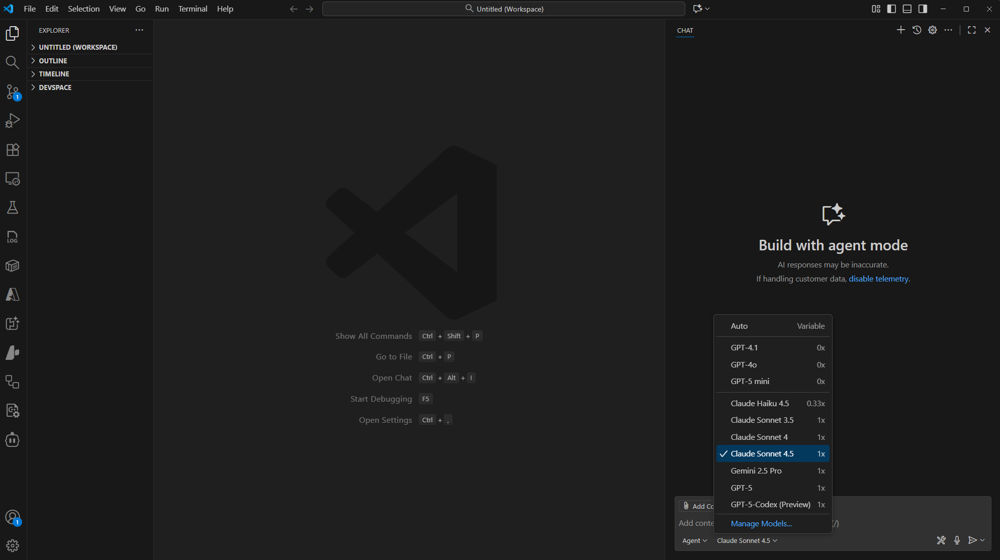

### ☁️ Azure Services Setup

**Follow the comprehensive guide:** [AZURE_SETUP_GUIDE.md](AZURE_SETUP_GUIDE.md)

**Required Services:**
- **Azure AI Foundry** - GPT-4o/GPT-5 deployments for AI agents
- **Azure Container Apps** - Backend API hosting with VNet integration
- **Azure Web Apps** - Frontend hosting with VNet integration
- **Azure Maps** - Geocoding and map visualization services
- **Azure Container Registry** - Docker image storage for deployment
- **Azure Virtual Network** - Private networking for container apps

**Optional Services:**
- **Azure AI Search** - Vector search for private data catalogs (RAG workflows)
- **Azure Application Insights** - Distributed tracing and performance monitoring
- **Azure Key Vault** - Secure storage of API keys and secrets
- **Azure Storage Account** - Blob storage for GEOINT processing results

**Data Sources (External):**
- **Microsoft Planetary Computer STAC API** - 113+ global satellite collections (free, public)
- **NASA VEDA STAC API** - Earth science datasets from NASA missions (free, public)

**Example Resource Group:**
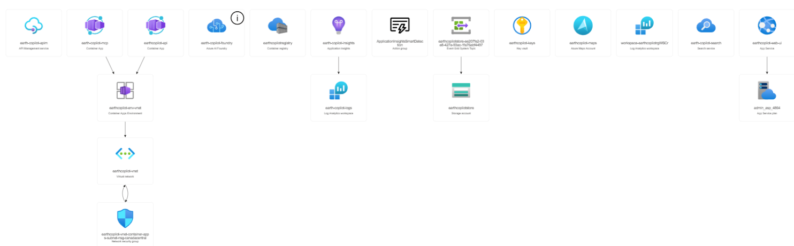

**Example Azure AI Foundry Deployment:**
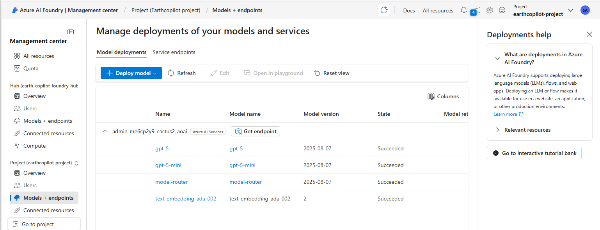

### 🔐 Environment Variables Configuration

The application requires **environment files for different components**:

**1. Root Environment (`.env`)** - Local development and deployment scripts
```bash
# Azure AI Foundry (GPT-4o/GPT-5 for agents)
AZURE_OPENAI_ENDPOINT=https://your-foundry.cognitiveservices.azure.com
AZURE_OPENAI_API_KEY=your_key_here
AZURE_OPENAI_DEPLOYMENT_NAME=gpt-5
AZURE_OPENAI_API_VERSION=2025-01-01-preview

# Azure Maps (Geocoding + Map tiles)
AZURE_MAPS_SUBSCRIPTION_KEY=your_maps_key
AZURE_MAPS_CLIENT_ID=your_client_id

# Azure Container Registry
ACR_NAME=yourregistry
ACR_LOGIN_SERVER=yourregistry.azurecr.io

# Resource Group
RESOURCE_GROUP=earthcopilot-rg
LOCATION=canadacentral
```

**2. Container App Environment (`earth-copilot/container-app/.env`)** - Backend API runtime
```bash
# Copy all variables from root .env plus:
STAC_API_URL=https://planetarycomputer.microsoft.com/api/stac/v1
PLANETARY_COMPUTER_STAC_URL=https://planetarycomputer.microsoft.com/api/stac/v1
NASA_VEDA_STAC_URL=https://veda.usgs.gov/api/stac

# Google Maps (optional - improves geocoding accuracy)
GOOGLE_MAPS_API_KEY=your_google_key

# Azure Storage (for GEOINT raster processing)
AZURE_STORAGE_CONNECTION_STRING=your_storage_connection
STORAGE_ACCOUNT_NAME=your_storage_account

# Application Insights (monitoring)
APPLICATIONINSIGHTS_CONNECTION_STRING=your_insights_connection
```

**3. Frontend Environment (`earth-copilot/web-ui/.env`)** - React UI runtime
```bash
VITE_API_BASE_URL=https://your-container-app-url.azurecontainerapps.io
VITE_AZURE_MAPS_SUBSCRIPTION_KEY=your_maps_key
VITE_AZURE_MAPS_CLIENT_ID=your_client_id
```

**4. MCP Server Environment (`earth-copilot/mcp-server/.env`)** - Model Context Protocol
```bash
EARTH_COPILOT_API_URL=https://your-container-app-url.azurecontainerapps.io
```

### 🤖 Automated Environment Collection

Use the provided script to automatically collect API keys from Azure:

```powershell
.\collect-env-vars.ps1
```

This script queries your Azure subscription and generates `.env` files with all required variables.

## 🚀 Deployment Guide

### ⚡ One-Command Deployment

```powershell
# 1. Deploy infrastructure (VNet, Container Registry, Container Apps, AI Foundry)
.\deploy-infrastructure.ps1

# 2. Collect environment variables from Azure
.\collect-env-vars.ps1

# 3. Deploy applications (backend + frontend)
cd earth-copilot
.\deploy-all.ps1
```

**📖 Detailed Deployment Instructions:** [DEPLOYMENT.md](DEPLOYMENT.md)

### 📜 Deployment Scripts

| Script | Purpose | Time | Location |
|--------|---------|------|----------|
| `deploy-infrastructure.ps1` | Deploy all Azure resources | 5-10 min | Root |
| `collect-env-vars.ps1` | Collect API keys/endpoints | 1 min | Root |
| `deploy-all.ps1` | Deploy backend + frontend | 8-12 min | earth-copilot/ |
| `deploy-backend.ps1` | Deploy Container App only | 5-8 min | earth-copilot/container-app/ |
| `deploy-frontend.ps1` | Deploy App Service only | 3-5 min | earth-copilot/web-ui/ |

### 🔌 MCP Server Deployment (Optional)

To enable GitHub Copilot integration:

```powershell
cd earth-copilot/mcp-server
.\deploy-with-logs.ps1
```

Then configure `.github/copilot/mcp-servers.json` with your MCP server URL.

**📖 MCP Integration Guide:** [earth-copilot/mcp-server/README.md](earth-copilot/mcp-server/README.md)

## 🧪 Testing & Verification

### ✅ Quick Health Check

```powershell
# Test backend API
curl https://your-container-app-url.azurecontainerapps.io/api/health

# Test MCP server
cd earth-copilot/mcp-server
python test_deployed_mcp.py https://your-mcp-url.azurecontainerapps.io
```

## 📚 Documentation

### 🏗️ Architecture & Design
- [Agent System Overview](documentation/architecture/agent_system_overview.md) - 10-agent architecture
- [Semantic Translator Logic](documentation/architecture/semantic_translator_logic.md) - NL to STAC translation

### 🛰️ Data Collections
- [STAC Collections](documentation/data_collections/stac_collections.md) - 113+ satellite collections
- [Maps Integration](documentation/data_collections/maps.md) - Azure/Google Maps setup
- [STAC Collections Guide](documentation/data_collections/stac_collections.md) - STAC API reference

### 🎯 GEOINT Capabilities
- [Building Damage Assessment](documentation/geoint_capabilities/BUILDING_DAMAGE_ASSESSMENT.md) - Damage analysis implementation
- [Mobility Analysis](documentation/geoint_capabilities/mobility_analysis.md) - Terrain traversability

### 📖 Setup Guides
- [AZURE_SETUP_GUIDE.md](AZURE_SETUP_GUIDE.md) - Azure services creation
- [DEPLOYMENT.md](DEPLOYMENT.md) - Deployment instructions  
- [STARTUP_GUIDE.md](STARTUP_GUIDE.md) - Quick start guide
- [SYSTEM_REQUIREMENTS.md](SYSTEM_REQUIREMENTS.md) - Technical requirements

## 📊 Data Collection Availability

### 📊 Coverage by Category

**🏔️ Elevation & Terrain - Excellent (95%+)**  
Primary: cop-dem-glo-30, cop-dem-glo-90, nasadem  
Best for: Topography, watersheds, slope analysis, GEOINT terrain assessment

**🔥 Fire Detection - High (90%+)**  
Primary: modis-14A1-061, modis-14A2-061, viirs-fire  
Best for: Wildfire tracking, burn assessment, thermal anomaly detection

**🌱 Vegetation/Agriculture - High (88%+)**  
Primary: modis-13Q1-061, modis-15A2H-061, sentinel-2-l2a  
Best for: Crop health, forest monitoring, NDVI analysis

**🛰️ Optical Satellite - Good (85%+)**  
Primary: sentinel-2-l2a, landsat-c2-l2, hls, naip  
Best for: True color imagery, urban development, land cover mapping

**📡 SAR/Radar - Good (82%+)**  
Primary: sentinel-1-grd, sentinel-1-rtc, alos-palsar  
Best for: Flood mapping, all-weather monitoring, surface deformation

**🌡️ Temperature/Thermal - Good (80%+)**  
Primary: modis-11A1-061, goes-cmi, landsat thermal bands  
Best for: Heat analysis, thermal stress, urban heat islands

**☁️ Climate & Weather - Variable (70%+)**  
Primary: era5-pds, daymet-daily-na, goes-cmi  
Best for: Historical weather, climate analysis, precipitation

**🌊 Marine & Ocean - Variable (65%+)**  
Primary: goes-cmi, modis-sst, sentinel-3  
Best for: Ocean temperature, water quality, coastal monitoring

**📖 Complete Collection Details:** [COLLECTIONS_MASTER_REFERENCE.md](documentation/data_collections/COLLECTIONS_MASTER_REFERENCE.md)


## 📁 Project Structure

```
earth-copilot-container/
├── 📁 earth-copilot/                 # Main application directory
│   ├── 📁 web-ui/                    # React frontend (App Service)
│   │   ├── 📁 src/
│   │   │   ├── 📁 components/         # React components
│   │   │   │   ├── Chat.tsx           # Chat interface with context
│   │   │   │   ├── MapView.tsx        # Azure Maps + satellite overlays
│   │   │   │   ├── DatasetDropdown.tsx # Data source selection
│   │   │   │   └── ...
│   │   │   ├── 📁 services/           # API integration
│   │   │   │   ├── api.ts             # Backend API client
│   │   │   │   └── vedaSearchService.ts # NASA VEDA integration
│   │   │   └── 📁 ui/                 # UI components
│   │   ├── .env.example               # Frontend environment template
│   │   ├── package.json               # Node.js dependencies
│   │   └── vite.config.ts             # Vite build config
│   │
│   ├── 📁 container-app/              # FastAPI backend (Container Apps)
│   │   ├── fastapi_app.py             # Main FastAPI application
│   │   ├── semantic_translator.py     # Agent 3: STAC query orchestrator
│   │   ├── location_resolver.py       # Multi-strategy geocoding
│   │   ├── collection_profiles.py     # Agent 2: Collection mappings
│   │   ├── intent_classifier.py       # Agent 1: Intent classification
│   │   ├── response_generator.py      # Agent 5: Response generation
│   │   ├── tile_selector.py           # Agent 4: Tile selection logic
│   │   ├── geoint_executor.py         # GEOINT orchestration
│   │   ├── terrain_analysis.py        # Agent 6: Terrain analysis
│   │   ├── mobility_classifier.py     # Agent 7: Mobility classification
│   │   ├── line_of_sight.py           # Line-of-sight calculations
│   │   ├── hybrid_rendering.py        # TiTiler rendering configs
│   │   ├── requirements.txt           # Python dependencies (full GEOINT)
│   │   ├── Dockerfile                 # Container build
│   │   └── 📁 archive/                # Legacy Azure Functions code
│   │
│   ├── 📁 mcp-server/                 # Model Context Protocol server
│   │   ├── main.py                    # MCP HTTP bridge
│   │   ├── earth_copilot_tools.py     # MCP tool definitions
│   │   ├── requirements.txt           # MCP dependencies
│   │   ├── Dockerfile                 # MCP container build
│   │   ├── deploy-with-logs.ps1       # Deployment script
│   │   ├── test_deployed_mcp.py       # Production tests
│   │   └── 📁 docs/                   # MCP documentation
│   │
│   ├── 📁 ai-search/                  # Azure AI Search setup
│   │   └── 📁 scripts/                # Index creation scripts
│   │       ├── create_veda_index.py   # NASA VEDA index
│   │       └── requirements.txt
│   │
│   ├── 📁 infra/                      # Infrastructure as Code
│   │   ├── main.bicep                 # Main Bicep template
│   │   └── 📁 app/                    # App-specific resources
│   │
│   └── azure.yaml                     # Azure Developer CLI config
│
├── 📁 documentation/                  # Project documentation
│   ├── 📁 architecture/
│   │   ├── agent_system_overview.md   # 10-agent architecture
│   │   └── semantic_translator_logic.md
│   ├── 📁 data_collections/
│   │   ├── COLLECTIONS_MASTER_REFERENCE.md # 113+ collections
│   │   ├── maps.md                    # Azure/Google Maps integration
│   │   └── stac_collections.md        # STAC API guide
│   ├── 📁 geoint_capabilities/
│   │   ├── BUILDING_DAMAGE_ASSESSMENT.md
│   │   └── mobility_analysis.md
│   └── 📁 images/                     # Screenshots and diagrams
│
├── 📁 scripts/                        # Utility scripts
│   └── 📁 stac_availability/          # STAC data exploration
│
├── 📁 .github/                        # GitHub configuration
│   └── 📁 copilot/
│       └── mcp-servers.json           # MCP server config for Copilot
│
├── deploy-infrastructure.ps1          # Deploy all Azure resources
├── collect-env-vars.ps1               # Collect API keys from Azure
├── .env.example                       # Root environment template
├── requirements.txt                   # Root Python dependencies (dev)
├── README.md                          # This file
├── DEPLOYMENT.md                      # Deployment guide
├── AZURE_SETUP_GUIDE.md              # Azure service setup
└── STARTUP_GUIDE.md                  # Quick start guide
```

## 📄 License

MIT License - see [LICENSE.txt](LICENSE.txt) for details.

## ⚖️ Trademarks

This project may contain trademarks or logos for projects, products, or services. Authorized use of Microsoft trademarks or logos is subject to and must follow [Microsoft's Trademark & Brand Guidelines](https://www.microsoft.com/en-us/legal/intellectualproperty/trademarks/usage/general). Use of Microsoft trademarks or logos in modified versions of this project must not cause confusion or imply Microsoft sponsorship. Any use of third-party trademarks or logos are subject to those third-party's policies.

---

## 🤝 Acknowledgments

Earth Copilot 2.0 was developed by Melisa Bardhi, advised by Juan Carlos Lopez and inspired by NASA's Earth Copilot 1.0 architected by Minh Nguyen.

A big thank you to our collaborators: 
- **Microsoft Planetary Computer** 
- **NASA**
- **Microsoft Team**: Juan Carlos Lopez, Jocelynn Hartwig & Minh Nguyen

*Built for the Earth science community with ❤️ and AI*
