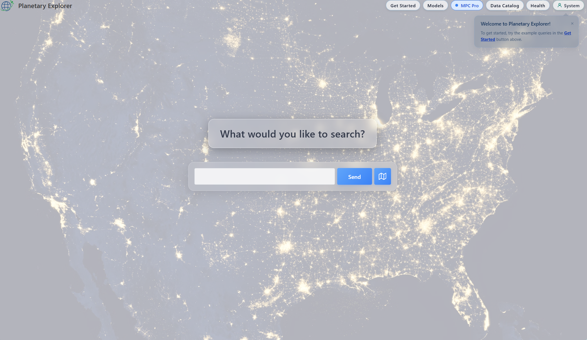
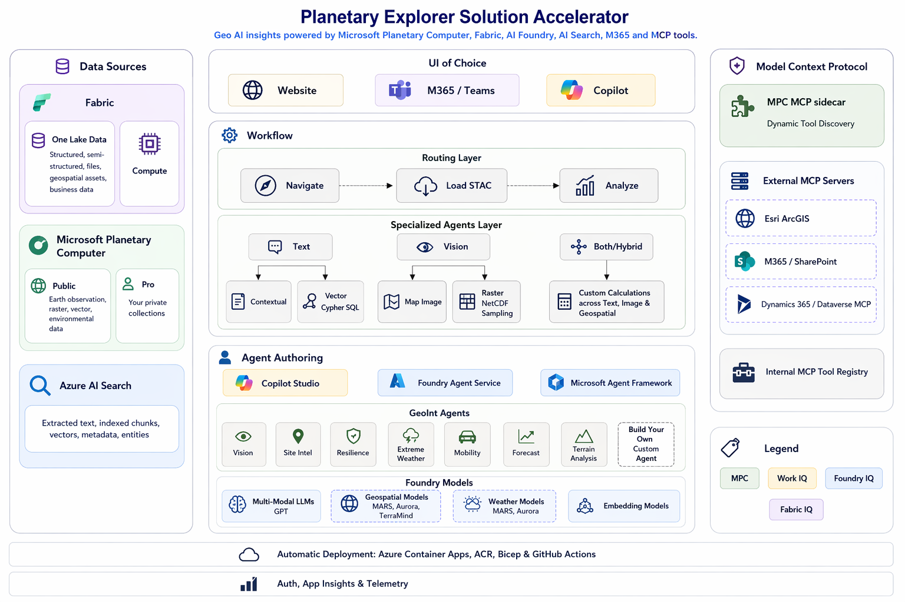

<div align="center">


[](https://codespaces.new/microsoft/planetary-explorer)

</div>

# 🌍 Welcome to Planetary Explorer!
Planetary Explorer, built on AI Foundry, demonstrates how organizations can use Microsoft Planetary Computer Pro to combine geospatial data with generative AI experiences. By enabling users to explore Earth science data through natural language, it makes complex geospatial workflows more accessible to analysts, operators, and decision makers—not just GIS specialists. This helps teams accelerate insight generation and support scenarios ranging from operational monitoring to risk management. 

## 📋 Overview

Planetary Explorer turns natural-language questions into grounded geospatial answers. Its multi-agent system picks the right data, renders it on the map, and reasons over the result.

It fuses mutliple surfaces behind one chat:
- **Microsoft Planetary Computer** — 130+ public STAC collections & MPC Pro / GeoCatalog in your tenant for private collections
- **Microsoft Fabric Lakehouse** — delta tables and compute feed workflows
- **Azure AI Search** — documentation for grounding responses
- **Foundry LLMs, weather + geospatial models** — GPT, Aurora, NVIDIA Earth-2 FCN, and MAI Weather

Meet users where they already work:
- **React web app** — purpose-built map + chat experience
- **Microsoft Teams** — chat with Planetary Explorer agents in any channel
- **M365 Copilot** — declarative agent surfaces the same answers inside Word, Outlook, and Copilot Chat
- **VS Code / Claude Desktop** — every agent exposed as MCP tools for developers

Built on **Microsoft Agent Framework**, **Azure AI Agent Service**, **Semantic Kernel** and **Model Context Protocol** so analysts, operators, and decision-makers spend less time wrangling data and more time acting on insight.

**Watch Satya Nadella introduce NASA Earth Copilot, the inspiration behind Planetary Explorer, at Microsoft Ignite 2024**: [View Here](https://www.linkedin.com/posts/microsoft_msignite-activity-7265061510635241472-CAYx/?utm_source=share&utm_medium=member_desktop)

**Auto-Deploy Ready:** This repository includes fully automated deployment via **Bicep** and **GitHub Actions**. Follow the [Quick Start Guide](QUICK_DEPLOY.md) to deploy the complete architecture: infrastructure, backend, and frontend within one hour. Its modular architecture is designed for extensibility.

> **Planetary Explorer is a reusable geospatial AI pattern that can be adapted across different use cases. It is not a supported Microsoft product.**



## ✨ Features

- **Multi-Agent Architecture** — Microsoft Agent Framework (MAF) workflows + Semantic Kernel + Azure AI Agent Service. 
- **Dual MPC Surface** — Chat over **MPC Public** *or* **MPC Pro / GeoCatalog** in your own tenant
- **Pluggable Connection Surfaces** — Bring your own **Microsoft Fabric** Lakehouse, **Azure AI Search** indexes, and **Foundry geospatial + weather models**. 
- **MCP Server** — Expose every agent as Model Context Protocol tools for VS Code GitHub Copilot, Claude Desktop, and other MCP clients.
- **Multiple Client Surfaces** — One backend, your choice of UI: a purpose-built React web app, a **Microsoft Teams bot**, or an **M365 Copilot** declarative agent.
- **Copilot Studio & ArcGIS** — Custom connectors for Copilot Studio, plus optional Esri ArcGIS integration for enterprise GIS workflows.
- **Fully Private Deployment** — Optional VNet integration with private endpoints, private DNS zones, and Entra ID authentication for an enterprise-ready deployment out of the box.



## 🎯 Use Cases

| | | | | |
|:---:|:---:|:---:|:---:|:---:|
| **Science & Environment** | **Agriculture & Natural Resources** | **Energy & Infrastructure** | **Public Safety & Emergency Management** | **Defense / National Security** |
| Accelerates climate, air quality, land-surface, extreme weather scenarios, and environmental research | Assess drought conditions, soil moisture, and water quality for agriculture planning | Monitor energy grids, transmission corridors, and dam infrastructure, supporting site selection and permitting | Supports response to wildfires, floods, hurricanes, and other natural disasters | Monitor geospatial intelligence and support situational awareness for national security operations |


## 🛰️ What Planetary Explorer Does


### Query Examples

<details>
<summary><b>STAC Agent — chat-to-map (MPC Public + MPC Pro)</b></summary>

| Query |
|-------|
| Show coastal land cover changes in California |
| Show me Sentinel-2 imagery over Los Angeles on May 20, 2026 |
| Show me radar imagery of Houston Texas during Hurricane Harvey August 2017 |

Flip the **MPC Pro** toggle in the UI and every STAC query now runs against your tenant's collections.

</details>

<details>
<summary><b>Raster Sampling + Contextual Agent</b></summary>

| Action | Query |
|--------|-------|
| Pin drop → Chat | Sample the raster value at this location |
| Chat | How do I interpret this collection? |
| Chat | Explain what each class in this land-cover raster means |

</details>

<details>
<summary><b>GEOINT Modules — Vision, Terrain, Mobility, Comparison, Building Damage</b></summary>

| Module | Query |
|--------|-------|
| **Vision** | Analyze this satellite image — what land cover types are visible and what is the surface reflectance? |
| **Terrain** | Is this location suitable for a construction permit? Analyze slope, flood risk, and flat areas. |
| **Terrain** | Analyze terrain elevation, slope, and line-of-sight at 38.9N, 77.0W |
| **Comparison** | Show wildfire activity in Southern California in January 2025 and analyze how it evolved over 48 hours |
| **Mobility** | Classify terrain traversability at these coordinates across 5 elevation layers |
| **Building Damage** | Assess building damage using before/after satellite imagery at these coordinates |

</details>

<details>
<summary><b>Extreme Weather Agent — NASA NEX-GDDP-CMIP6 (NetCDF + trend reasoning)</b></summary>

| Query |
|-------|
| What is the projected annual precipitation and peak daily rainfall for New Orleans? |
| Compute the precipitation trend for New Orleans from 2020 to 2080 |
| What are the projected temperature and precipitation trends for Miami through 2050? |

</details>

<details>
<summary><b>Forecast Agent — 3-model ensemble (Aurora + Earth-2 FCN + MAI Weather)</b></summary>

| Query |
|-------|
| Give me a 5-day forecast over the Gulf of Mexico, ensemble view |
| Forecast 2m temperature and 10m wind for Texas through Friday |
| Compare Aurora vs Earth-2 FCN for tomorrow's precipitation over the Florida peninsula |

</details>

<details>
<summary><b>Site Intel Agent — Fabric + MPC siting workflow</b></summary>

| Query |
|-------|
| Score these candidate data-center sites in Texas for power, water, competition, and hazard |
| Which of our candidate parcels in the Permian basin clears slope + flood + heat thresholds? |
| Rank the top 3 sites near Phoenix with permitting precedent and grid-proximity weighted highest |


</details>

<details>
<summary><b>Resilience Agent — continuous monitoring on Fabric + MPC </b></summary>

| Query |
|-------|
| What facilities are at risk over the next 7 days, and what's the supply-chain blast radius? |
| If our Houston DC goes offline for 48 hours, which downstream facilities are exposed? |
| Show heat + wildfire risk for all West Coast facilities this week, ranked by severity |


</details>


### Examples

<table>
<tr>
<td align="center" width="25%"><b>ALOS World (Berlanga)</b><br/></td>
<td align="center" width="25%"><b>Burn Severity (California)</b><br/></td>
<td align="center" width="25%"><b>Cropland (Florida)</b><br/></td>
<td align="center" width="25%"><b>Elevation (Grand Canyon)</b><br/></td>
</tr>
<tr>
<td align="center"><b>HLS Greece Elevation</b><br/></td>
<td align="center"><b>LIDAR Height (New Orleans)</b><br/></td>
<td align="center"><b>MODIS Snow Cover (Quebec)</b><br/></td>
<td align="center"><b>Nadir BDRF (Mexico)</b><br/></td>
</tr>
<tr>
<td align="center"><b>Net Production (San Jose)</b><br/></td>
<td align="center"><b>Sea Surface Temp (Madagascar)</b><br/></td>
<td align="center"><b>Sentinel (NYC)</b><br/></td>
<td align="center"><b>Sentinel RTC (Philippines)</b><br/></td>
</tr>
<tr>
<td align="center"><b>Surface Water (Bangladesh)</b><br/></td>
<td align="center"><b>Vegetation Indices (Ukraine)</b><br/></td>
<td align="center"><b>Vision Agent</b><br/></td>
<td align="center"><b>Vision Agent</b><br/></td>
</tr>
<tr>
<td align="center"><b>Terrain Agent</b><br/></td>
<td align="center"><b>Terrain Agent</b><br/></td>
<td align="center"><b>Terrain Agent</b><br/></td>
<td align="center"><b>Mobility Agent</b><br/></td>
</tr>
<tr>
<td align="center"><b>Mobility Agent</b><br/></td>
<td align="center"><b>Extreme Weather Agent</b><br/></td>
<td align="center"><b>Extreme Weather Agent</b><br/></td>
<td align="center"><b>Thermal Anomalies (Australia)</b><br/></td>
</tr>
</table>

---


## 🏗️ Architecture


### Core Services

**React UI (`planetary-explorer/web-ui/`) - Azure Web Apps**
- **Main Search Interface**: Unified natural language query input
- **Chat Sidebar**: Conversation history with context awareness
- **Azure Maps Integration**: Interactive map with satellite overlay and geointelligence results
- **Data Catalog Selector**: Switch between MPC, NASA VEDA, and custom data sources
- **Technology**: React 18, TypeScript, Vite, Azure Maps SDK v2

**Container App Backend (`planetary-explorer/container-app/`) - Azure Container Apps**
- **Microsoft Agent Framework + Semantic Kernel + Azure AI Agent Service**: Mixed-framework orchestration over Azure AI Foundry (GPT-5 or model of choice)
- **MCP Runtime** (`mcp_runtime/`): Public STAC adapter + Pro MCP sidecar client; agents default to public MPC for reasoning, Pro for governed chat
- **Fabric Connector**: Delta-table reads for Site Intel + Resilience (power, water, candidate sites, facilities, supply edges)
- **Weather Provider Registry** (`connectors/weather`): Pluggable providers — Aurora, Earth-2 FCN, MAI Weather — used by the Forecast Agent
- **NetCDF Reasoning**: NASA NEX-GDDP-CMIP6 sampling + linear-regression trend analysis (Extreme Weather Agent)
- **STAC Integration**: Microsoft Planetary Computer (Public + Pro / GeoCatalog) and NASA VEDA
- **Geointelligence Processing**: Terrain, mobility, line-of-sight (GDAL/Rasterio)
- **Multi-Strategy Geocoding**: Google Maps, Azure Maps, Mapbox, OpenAI fallback
- **Hybrid Rendering System**: TiTiler for 130+ satellite collection types
- **VNet Integration**: Enterprise-grade security with private networking (optional)
- **Technology**: Python 3.12, FastAPI, Microsoft Agent Framework, Semantic Kernel, MCP, Azure Container Apps

**Azure Infrastructure**
- **Azure AI Foundry**: Model deployments for agent intelligence (GPT-5 or model of choice); host for MAI Weather forecast provider
- **Azure AI Agent Service**: Multi-turn tool orchestration for GEOINT agents (Hub + Project)
- **Microsoft Planetary Computer Pro / GeoCatalog**: Tenant-scoped STAC for governed and private collections (opt-in)
- **Microsoft Fabric**: Lakehouse Delta tables for Site Intel + Resilience (opt-in via `-EnableFabric`)
- **Azure Maps**: Geocoding, reverse geocoding, and map tile services
- **Azure AI Search**: Vector search for private data catalogs (RAG) and BCP / permitting precedent docs
- **Azure Storage**: Blob storage for geointelligence raster processing results
- **Virtual Network**: Private networking with private endpoints and DNS resolution (opt-in)

**MCP Server (`planetary-explorer/mcp-server/`) - Model Context Protocol (Optional)**
- **GitHub Copilot Integration**: Expose Planetary Explorer as tool for VS Code
- **HTTP Bridge**: MCP protocol bridge for external tool access
- **Technology**: Python, FastAPI, Docker, Azure Container Apps

**Copilot Studio - M365 Integration (Optional)**
- **Teams Bot**: Chat with Planetary Explorer directly inside Microsoft Teams
- **M365 Copilot Plugin**: Extend Microsoft 365 Copilot with geospatial capabilities
- **Custom Connector**: Points to the deployed backend API — no additional infrastructure required


## ⚙️ Environment Setup

### Prerequisites

**Technical Background:**
- **Azure Subscription Management** - Resource groups, RBAC, cost management, service quotas
- **Azure Cloud Services** - Azure AI Foundry, Azure Maps, Container Apps, AI Search
- **Python Development** - Python 3.12, FastAPI, async programming, package management
- **React/TypeScript** - React 18, TypeScript, Vite, modern JavaScript
- **AI/ML Concepts** - LLMs, Semantic Kernel, multi-agent systems, RAG
- **Microsoft Agent Framework & MCP** - MAF `WorkflowBuilder` graphs, Model Context Protocol clients/servers
- **Microsoft Fabric / Delta Lake** - Lakehouse workspaces, Delta tables, SQL endpoint access
- **Geospatial Data** - STAC standards, satellite imagery, raster processing (GDAL/Rasterio)
- **Docker & Containers** - Docker builds, Azure Container Apps, VNet integration
- **Infrastructure as Code** - Bicep templates, Azure CLI, resource deployment

### Quick Start with VS Code Agent Mode

You can deploy this application using **Agent mode in Visual Studio Code** or **GitHub Codespaces**:

[](https://codespaces.new/microsoft/planetary-explorer)

## 🚀 Deployment

Full, step-by-step deployment instructions — GitHub Actions and local one-command deploy, what gets provisioned, opt-in flags (`-EnableMpcPro`, `-EnableFabric`, `-EnableWeatherModels`, `-EnablePrivateEndpoints`), multi-environment setup, and Copilot Studio / MCP / ArcGIS integrations — live in:

[**QUICK_DEPLOY.md →**](QUICK_DEPLOY.md)

```powershell
# Quickest path: clone your fork and run the one-command local deploy
git clone https://github.com/YOUR-USERNAME/Planetary-Explorer.git
cd Planetary-Explorer
.\deploy-infrastructure.ps1
```

## 📄 License

MIT License - see [LICENSE.txt](LICENSE.txt) for details.

## ™️ Trademarks

This project may contain trademarks or logos for projects, products, or services. Authorized use of Microsoft trademarks or logos is subject to and must follow [Microsoft's Trademark & Brand Guidelines](https://www.microsoft.com/en-us/legal/intellectualproperty/trademarks/usage/general). Use of Microsoft trademarks or logos in modified versions of this project must not cause confusion or imply Microsoft sponsorship. Any use of third-party trademarks or logos are subject to those third-party's policies.

---

## 🙏 Acknowledgments

Planetary Explorer was developed by Melisa Bardhi and advised by Juan Carlos Lopez.

A big thank you to our collaborators: 
- **Microsoft Planetary Computer** 
- **NASA**
- **Microsoft Team**: Juan Carlos Lopez, Jocelynn Hartwig, Minh Nguyen & Matt Morrell.

*Built for the Earth science community with ❤️ and AI*
