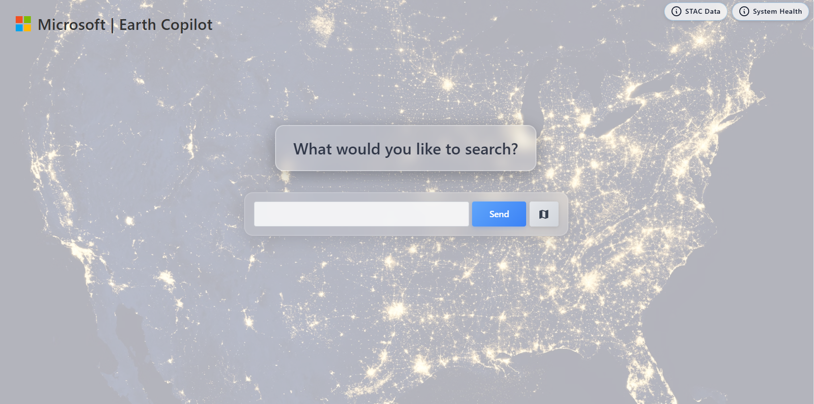

[](https://codespaces.new/melisabardhi/EC)

# 🌍 Welcome to Earth Copilot!

**An AI powered geospatial application that allows you to explore and visualize vast Earth science data using natural language.**

Earth Copilot leverages advanced AI and semantic understanding to transform natural language queries into interactive geospatial visualizations, enabling researchers and scientists to explore 126+ Microsoft Planetary Computer (MPC) SpatioTemporal Asset Catalog (STAC) collections from global Earth observation missions. The application empowers users to search private, public, or hybrid datasets, query STAC APIs, and generate map visualizations with intelligent answers to Earth science questions.

## ✨ What Earth Copilot Does



**1) Queries that require map visualizations**
- "Show me satellite imagery of Dubai urban expansion in 2020"
- "Show me radar imagery of Houston Texas during Hurricane Harvey August 2017"
- "Show me HLS Landsat imagery for Washington State forests from 2024"
- "Show me burned area mapping for Montana wildfire regions 2023"
- "Show me land surface temperature for Kansas wheat fields during summer 2024"

Data Flow: User Query → React UI → Azure Function App → Semantic Kernel → Microsoft Planetary Computer STAC APIs → Results → Map Visualization and Response

**2) Contextual queries looking for information**
- "How was NYC impacted by Hurricane Sandy"
- "What was the impact of Hurricane Florence 2018 in the North Carolina Outer Banks in 2018"
- "How did vegetation recover after flooding in Missouri River valley 2023"
- "What are the long-term climate trends affecting Pacific Northwest forests"
- "Explain the correlation between El Niño events and wildfire patterns in California"

Data Flow: User Query → React UI → Azure Function App → Semantic Kernel & LLM → Results → Chat Response

**3) Queries grounded in private storage data through Retrieval Augmented Generation (RAG)**
- "Analyze our proprietary STAC collection for mineral exploration sites in Nevada"
- "Compare our private agricultural monitoring data with public MODIS vegetation indices"
- "Search our internal disaster response imagery catalog for similar flood patterns"
- "Query our custom satellite constellation data for urban heat island analysis"
- "Find relevant datasets in our private STAC catalog for infrastructure monitoring projects"

Data Flow: React UI → Data Catalog Selection → User Chat Query → NASA VEDA AI Search Index & LLM → Chat Response

### Search Examples


## Architecture


### Core Services

**⚛️ React UI (`earth-copilot/react-ui/`)**
- **Main entry point UI:** Unified query search for all requests
- **Chat Interface**: GeoCopilot chat panel with conversation history leveraging Azure AI and semantic understanding
- **Map Visualization**: Azure Maps integration with satellite data overlays
- **Data Catalog Pane**: Connection to private, public and hybrid data sources

**🔧 Router Function App (`earth-copilot/router-function-app/`)**
- **Semantic Kernel Translator**: Agentic query classification and entity extraction that translates natural language to customized STAC parameter queries
- **Location Resolver**: Multi-strategy geocoding for map rendering of diverse data catalog types (Azure Maps, Nominatim, AI)
- **Temporal Resolver**: Resolves query datetimes to correct search format
- **Collection Mapper**: Intelligent satellite data collection selection that routes search to most appropriate STAC data catalog depending on query intent
- **STAC Integration**: Function app API connectivity to Microsoft Planetary Computer for executing translated queries

**🗄️ Core Infrastructure (`earth-copilot/core/`)**
- **Configuration Management**: Environment variables and settings
- **Logging System**: Structured logging for debugging and monitoring
- **Error Handling**: Robust error recovery and feedback

## 📁 Project Structure

```
EC/
├── 📁 earth-copilot/                 # Main application directory
│   ├── 📁 react-ui/                  # React frontend application
│   │   ├── 📁 src/
│   │   │   ├── 📁 components/         # React components
│   │   │   │   ├── Chat.tsx           # Main chat interface
│   │   │   │   ├── MapView.tsx        # Azure Maps integration
│   │   │   │   ├── DatasetDropdown.tsx # Data source selection
│   │   │   │   └── ...
│   │   │   ├── 📁 services/           # API integration services
│   │   │   │   ├── api.ts             # Backend API calls
│   │   │   │   └── vedaSearchService.ts # VEDA search integration
│   │   │   └── 📁 ui/                 # UI layout components
│   │   ├── .env.example               # Frontend environment template
│   │   ├── package.json               # Node.js dependencies
│   │   └── vite.config.ts             # Vite build configuration
│   ├── 📁 router-function-app/        # Azure Functions backend
│   │   ├── function_app.py            # Main API endpoints
│   │   ├── semantic_translator.py     # NL to STAC translation
│   │   ├── location_resolver.py       # Geocoding services
│   │   ├── collection_profiles.py     # Data collection mappings
│   │   ├── local.settings.json.example # Function app config template
│   │   ├── requirements.txt           # Python dependencies
│   │   └── host.json                  # Azure Functions configuration
│   ├── 📁 core/                       # Shared utilities
│   │   ├── config.py                  # Configuration management
│   │   └── logging.py                 # Logging utilities
│   ├── 📁 infra/                      # Infrastructure as Code
│   │   ├── main.bicep                 # Main Bicep template
│   │   └── 📁 app/                    # Application-specific resources
│   ├── 📁 ai-search/                  # Azure AI Search setup
│   │   └── 📁 scripts/                # Search index creation
│   └── azure.yaml                     # Azure Developer CLI config
├── 📁 documentation/                  # Project documentation
│   ├── 📁 images/                     # Screenshots and diagrams
│   ├── endpoint_architecture.md       # API documentation
│   ├── semantic_translator_logic.md   # Translation logic docs
│   └── ...
├── 📁 tests/                          # Test suites
│   ├── 📁 e2e/                        # End-to-end tests
│   ├── 📁 integration/                # Integration tests
│   ├── 📁 unit/                       # Unit tests
│   └── 📁 debug/                      # Debug utilities
├── 📁 scripts/                        # Utility scripts
│   └── 📁 stac_availability/          # STAC data exploration
├── 📁 tools/                          # Development tools
├── .env.example                       # Root environment template
├── README.md                          # This file
├── AZURE_SETUP_GUIDE.md              # Azure setup instructions
├── STARTUP_GUIDE.md                  # Quick start guide
├── setup-all-services.sh             # Automated setup script
└── requirements.txt                   # Root Python dependencies
```


## 🔧 Environment Set Up

### Configure Agent Mode 
You can deploy this application using Agent mode in Visual Studio Code, your preferred IDE or using Code Spaces directly: [](https://codespaces.new/melisabardhi/EC)


### Create your Azure Services

Create all required Azure services for complete architecture. **Follow the detailed guide: [AZURE_SETUP_GUIDE.md](AZURE_SETUP_GUIDE.md)**

This guide covers step-by-step creation of required services:

**Required Services:**
- **Azure AI Foundry** - Core AI query processing and natural language understanding with GPT-5 deployment
- **Azure Maps** - Geographic coordinate resolution and location services  
- **Azure Function App** - Serverless compute for backend API endpoints
- **Azure AI Search** - Vector search and document indexing for enhanced query capabilities

**Optional Services:**
- **Azure Application Insights** - Performance monitoring and diagnostics
- **Azure Key Vault** - Secure storage of API keys and secrets
- **Azure Static Web Apps** - Frontend hosting for production deployment

**Data Sources:**
- **Microsoft Planetary Computer STAC APIs** - Global satellite data catalog with standardized geospatial data access
- **NASA VEDA** - Hosts Earth science datasets from NASA missions and research programs

An example of what earth copilot resource group and services could look like: 


An example of what Foundry model deployment could look like: 


### Connect your environment variables

The application requires **multiple environment files** for different components:

1. **Root Environment**: Create `.env` file in project root containing Azure service credentials
   - Template: See `.env.example` for required variables
   - Purpose: Backend API services (Azure OpenAI, Azure Maps, etc.)

2. **React UI Environment**: Create `.env` file in `earth-copilot/react-ui/`
   - Template: See `earth-copilot/react-ui/.env.example` 
   - Purpose: Frontend variables (all prefixed with `VITE_`)

3. **Function App Settings**: Configure `earth-copilot/router-function-app/local.settings.json`
   - Template: See `local.settings.json.example` in the same directory
   - Purpose: Azure Functions runtime configuration

**Setup**: Copy each `.example` file, remove the `.example` extension, and fill in your Azure service credentials.

## 🚀 Getting Started

### **Complete Setup Required**

Earth Copilot requires Azure services and proper configuration to function. Follow these guides in order:

1. **🔧 Azure Services Setup**: [AZURE_SETUP_GUIDE.md](AZURE_SETUP_GUIDE.md)
   - Create Azure AI Foundry (GPT-5 deployment)
   - Set up Azure Maps and AI Search
   - Configure environment variables

2. **🚀 Application Startup**: [STARTUP_GUIDE.md](STARTUP_GUIDE.md)
   - Install dependencies and run the application
   - Multiple startup options (automated, VS Code, manual)
   - Testing and troubleshooting

3. **⚙️ Technical Reference**: [SYSTEM_REQUIREMENTS.md](SYSTEM_REQUIREMENTS.md)
   - Detailed system requirements and dependencies
   - Version compatibility matrix
   - Advanced troubleshooting

### ⚠️ Important Notes
- **Semantic Kernel 1.36.2** required - the setup script installs the correct version
- **Imports**: Run `python verify-requirements.py` to check for compatibility 

### **Quick Commands (After Setup)**
```bash
# First-time setup (after Azure services are created)
./setup-all-services.sh

# Start all services (automated - recommended)
./run-all-services.sh

# Manual development (two terminals required)
# Terminal 1: cd earth-copilot/router-function-app && func host start
# Terminal 2: cd earth-copilot/react-ui && npm run dev

# Access at: http://localhost:5173
```

---
# 📊 Earth Copilot Data Catalogs & Features Reference

Below is a summary of collections and visualization capabilities available in Earth Copilot based on the latest assessment of MPC data catalog availability. 

## 📈 **Data Catalog Availability Rates**

**🏔️ Elevation & Terrain - Excellent Availability**
Primary collections: cop-dem-glo-30, cop-dem-glo-90 | Best for: topography, watersheds, slope analysis

**🔥 Fire Detection - High Availability**
Primary collections: modis-14A1-061, modis-14A2-061, modis-64A1-061 | Best for: wildfire tracking, burn assessment

**🌱 Vegetation/Agriculture - High Availability**
Primary collections: modis-13Q1-061, modis-11A1-061, modis-15A2H-061 | Best for: crop health, forest monitoring

**🌡️ Temperature/Thermal - High Availability**
Primary collections: modis-11A1-061, goes-cmi | Best for: heat analysis, thermal stress

**🌟 Snow & Ice - High Availability**
Primary collections: modis-10A1-061, viirs-snow-cover | Best for: snow coverage, seasonal analysis

**🏙️ Urban/Infrastructure - Good Availability**
Primary collections: naip, sentinel-2-l2a | Best for: city planning, development tracking

**📡 SAR/Radar - Good Availability**
Primary collections: sentinel-1-grd, sentinel-1-rtc | Best for: flood mapping, all-weather monitoring

**🛰️ Optical Satellite - Good Availability**
Primary collections: sentinel-2-l2a, landsat-c2-l2, hls2-l30 | Best for: urban development, coastal monitoring

**☁️ Climate & Weather - Variable Availability**
Primary collections: era5-pds, daymet-daily-na | Best for: historical weather, climate analysis

**🌊 Marine & Ocean - Variable Availability**
Primary collections: goes-cmi, modis-sst | Best for: ocean temperature, water quality


## 📄 License

MIT License - see [LICENSE](LICENSE) for details.

---

## 🤝 Acknowledgments

Earth Copilot 2.0 was advised by Juan Carlos and inspired by NASA's Earth Copilot 1.0 announced at Microsoft Ignite 2024 (🎥 [View Here](https://www.linkedin.com/posts/microsoft_msignite-activity-7265061510635241472-CAYx/?utm_source=share&utm_medium=member_desktop))

A big thank you to our collaborators: 
- **Microsoft Planetary Computer** 
- **NASA**
- **Microsoft Team**: Jocelynn Hartwig & Minh Nguyen

*Built for the Earth science community with ❤️ and AI*
